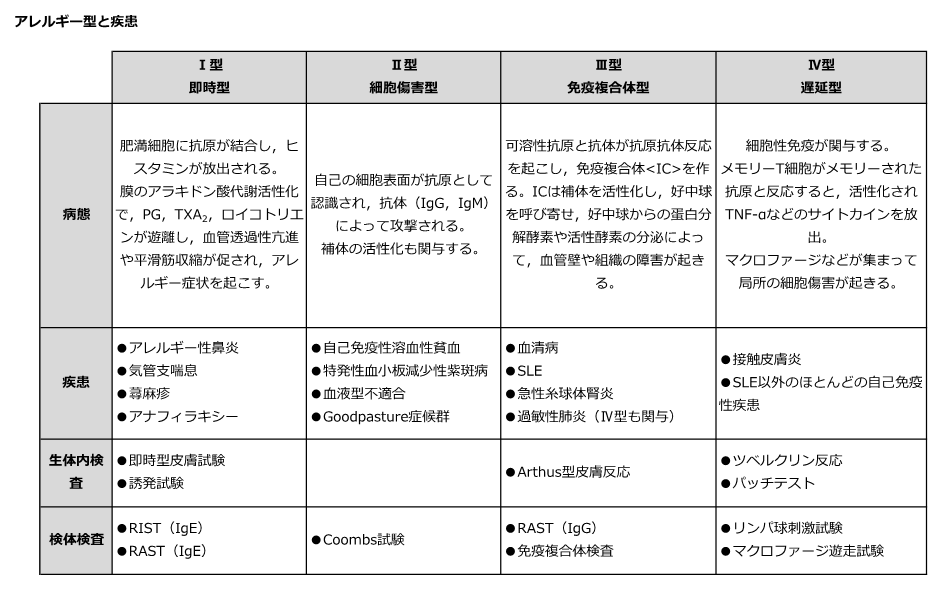

# Gell-Coombs分類

> **Gell-Coombs分類**は、過敏反応をI〜IV型に分ける分類である。疾患では複数の機序が重なることもあるため、代表的な組合せとして覚える。

## 要点

| 型 | 主な機序 | 代表例・検査 |
|---|---|---|
| I型（即時型） | IgE＋肥満細胞 → ヒスタミンなど | [[アナフィラキシー]]、[[気管支喘息]]、[[蕁麻疹]]／皮膚プリック、特異的IgE |
| II型（抗体媒介性） | IgG・IgMが細胞表面抗原に結合 | [[自己免疫性溶血性貧血]]、[[Goodpasture症候群]]／[[Coombs試験]] |
| III型（免疫複合体型） | 免疫複合体の沈着 → 補体活性化・炎症 | [[全身性エリテマトーデス（SLE）]]、[[血清病]]、Arthus反応 |
| IV型（遅延型） | T細胞による細胞性免疫 | [[接触皮膚炎]]、ツベルクリン反応、移植拒絶／パッチテスト |

- I型は抗原曝露後、通常は短時間で発症する。気管支平滑筋収縮、血管透過性亢進、粘液分泌亢進を来す。
- II型は抗体が細胞・組織の抗原を標的にし、補体や貪食などを介して障害する。
- III型は可溶性抗原と抗体による免疫複合体が血管壁・糸球体などに沈着して炎症を起こす。
- IV型は感作T細胞が関与し、反応まで時間を要する。**抗体ではなくT細胞**が中心である。

提示図はI〜IV型の全体像を示す。RASTは現在、血清**特異的IgE検査**と表現することが多い。

## CBTチェック

- 即時型：IgE／遅延型：T細胞。
- [[自己免疫性溶血性貧血]]はII型、[[急性糸球体腎炎]]・SLEはIII型、接触皮膚炎はIV型。
- ツベルクリン反応・パッチテストはIV型である。
