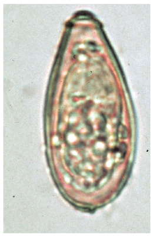

# 肝吸虫

> 肝吸虫（*Clonorchis sinensis*）は、淡水魚の生食で感染し、成虫が胆管に寄生する[吸虫](蠕虫.md)である。

## 要点

- 東アジアに分布し、淡水魚中のメタセルカリアを摂取して感染する。
- 多くは無症状だが、胆管の炎症・閉塞により右上腹部痛、肝機能障害、黄疸などを生じる。
- 診断は便中虫卵の検出。虫卵は小型のとっくり状で、小蓋とその周囲の肩状隆起をもつ。
- 慢性感染は[[胆管癌]]の危険因子となり、治療の第一選択は[[プラジカンテル]]である。

M3E問題18403790の肝吸虫卵（個人学習用）。上端の小蓋と、とっくり状の輪郭に注目する。

## CBTチェック

- 淡水魚の生食 → 胆管寄生 → 便中に小蓋をもつ虫卵、の組合せを押さえる。
- [肺吸虫](肺吸虫.md)は淡水産カニ・ザリガニから感染し肺へ、[日本住血吸虫](日本住血吸虫.md)はセルカリアが経皮感染して門脈系へ寄生する。
- 肝吸虫卵と横川吸虫卵は形態が似るため、肝胆道症状などの臨床像も合わせて判断する。
