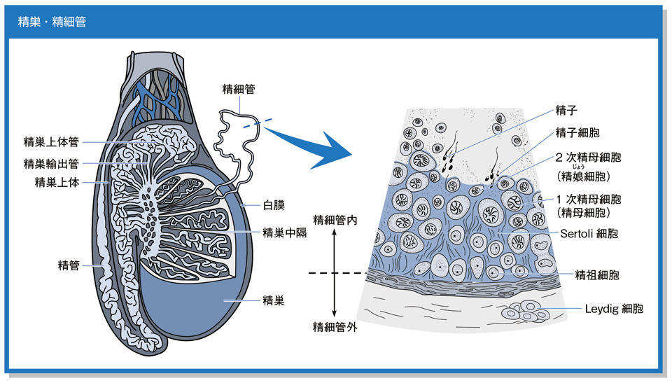

# 精子形成

> **精子形成**は、精細管で精原細胞から精子が作られる過程である。減数分裂で半数体となり、最後に形態変化を経て精子となる。

精細管内で、基底膜側から管腔側へ向かって分化が進む。

## 要点

- **精原細胞（2n）**が有糸分裂し、DNA複製後に**一次精母細胞（2n）**となる。
- 一次精母細胞 → 減数第一分裂 → **二次精母細胞（n）** → 減数第二分裂 → **精子細胞（n）** → 形態変化（精子完成）→ **精子（n）**。
- DNA合成は減数第一分裂の前に行われ、精子細胞は分裂・DNA合成をしない。
- **Sertoli細胞**は精子形成を支持・栄養し、細胞間の密着結合で[[血液精巣関門]]を形成する。FSHに反応する。
- **Leydig細胞**は精細管の間質にあり、LHに反応して[[テストステロン]]を分泌する。

## CBTチェック

- 精子は減数分裂を終えた**半数体**である。
- 血液精巣関門をつくるのはSertoli細胞、テストステロンを分泌するのはLeydig細胞である。
- 精原細胞は基底膜側、精子は精細管の管腔側に位置する。
