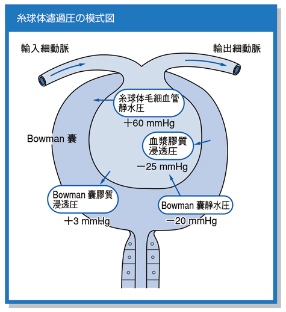
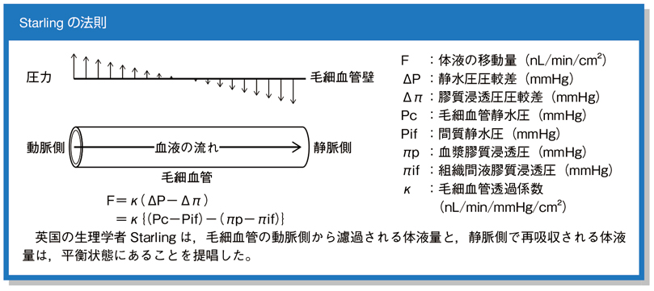

# 糸球体濾過圧

> **糸球体濾過圧**（正味濾過圧）は、糸球体毛細血管から[[Bowman嚢]]へ水が濾過される正味の圧である。濾過を促す圧から、濾過を妨げる圧を引いて求める。

糸球体からBowman嚢へ向かう圧を正、逆向きの圧を負として扱う。

Starlingの法則では、静水圧差から膠質浸透圧差を引く。

## 計算

`正味濾過圧 ＝（糸球体毛細血管静水圧＋Bowman嚢膠質浸透圧）－（Bowman嚢内静水圧＋血漿膠質浸透圧）`

| 圧の向き | 因子 |
|---|---|
| 濾過を促す | 糸球体毛細血管静水圧、Bowman嚢膠質浸透圧 |
| 濾過を妨げる | Bowman嚢内静水圧、血漿膠質浸透圧 |

- 例：`（60＋3）－（20＋25）＝18 mmHg`
- 通常、Bowman嚢内の蛋白はほぼないため、Bowman嚢膠質浸透圧はほぼ0 mmHgである。
- [[糸球体濾過量（GFR）]]は、`濾過係数（Kf）× 正味濾過圧`で表される。

## CBTチェック

- [[尿路閉塞]]ではBowman嚢内静水圧が上昇し、濾過圧・GFRが低下する。
- 低アルブミン血症では血漿膠質浸透圧が低下し、濾過圧は上昇する方向に働く。
- GFRの恒常性維持には[傍糸球体装置](傍糸球体装置.md)（レニン分泌・尿細管糸球体フィードバック）が関与する。
