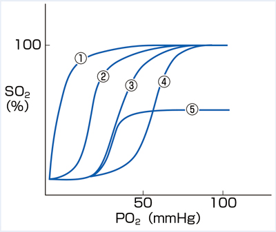
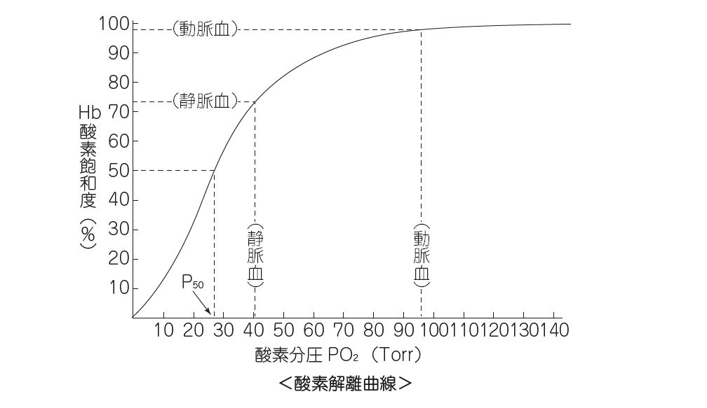

# ヘモグロビン代謝

> 老化赤血球は主に脾臓・肝臓のマクロファージに処理され、[[ヘモグロビン]]はグロビンとヘムに分解される。グロビンと鉄は再利用され、ヘムのポルフィリン環は[[ビリルビン]]となって排泄される。

## 代謝の流れ

- 赤血球の寿命は約120日で、老化すると網内系で貪食される。
- **ヘモグロビン → グロビン＋ヘム**：グロビンはアミノ酸へ分解され、再利用される。
- **ヘム → 鉄＋ビリベルジン＋一酸化炭素**：ヘムオキシゲナーゼが反応を触媒し、鉄は[[トランスフェリン]]で運搬、[[フェリチン]]として貯蔵され、造血に再利用される。
- **ビリベルジン → [[間接ビリルビン]]**：間接ビリルビンは脂溶性で、[[アルブミン]]と結合して肝臓へ運ばれる。
- 肝細胞でUDP-グルクロン酸転移酵素1A1（UGT1A1）によりグルクロン酸抱合されて水溶性の[[直接ビリルビン]]となり、胆汁へ排泄される。腸内細菌によりウロビリノゲンとなり、大部分は便中のステルコビリン、一部は再吸収されて腸肝循環し、さらに少量が尿中へ排泄されウロビリンとなる。

```text
直接ビリルビン → 胆汁 → 腸管 → ウロビリノゲン
                                  ├→ 大部分：ステルコビリン → 便
                                  └→ 一部：門脈へ再吸収
                                           ├→ 大部分：肝で回収 → 胆汁へ再排泄
                                           └→ 少量：体循環 → 腎 → 尿中ウロビリノゲン
                                                                    ↓ 酸化
                                                                 ウロビリン
```

この腸肝循環で再吸収されるのは胆汁そのものではなく、腸内で生成されたウロビリノゲンである。

## 胎児ヘモグロビンと酸素解離曲線

- 胎児ヘモグロビン（HbF）は **α₂γ₂**、成人ヘモグロビン（HbA）は主に **α₂β₂** で構成される。
- HbFは2,3-BPGとの結合が弱く、同じ酸素分圧ではHbAより酸素親和性が高い。そのためHbFの酸素解離曲線は左方偏位し、胎盤で母体血から酸素を受け取りやすい。
- 酸素解離曲線の右方偏位（ボーア効果）：pH低下（アシドーシス）、二酸化炭素増加、体温上昇、2,3-BPG増加。組織での酸素放出を促進する。
- 新生児ではHbFの割合が高いが、出生後に徐々にHbAへ置き換わる。HbFの高い酸素親和性は組織での酸素放出が少なくなる方向にも働くため、右方偏位因子とのバランスで考える。

### 酸素解離曲線（提示画像、個人学習用）

酸素解離曲線は、酸素分圧（PO₂）とヘモグロビン酸素飽和度（SO₂）の関係を示す。左方偏位は酸素を結合しやすく、右方偏位は組織へ酸素を放出しやすい。M3E CBT問題279933154の提示画像では、**成人Hbは③、胎児Hbは②**に相当する。



P₅₀はHb酸素飽和度が50％になる酸素分圧で、低いほど酸素親和性が高い。動脈血では飽和度が高く、静脈血では組織で酸素が放出された分だけ低下する。



## CBTチェック

- **ヘム → ビリベルジン → 間接ビリルビン → 肝で抱合 → 直接ビリルビン**の順である。
- アルブミンと結合するのは脂溶性の間接ビリルビンで、グルクロン酸抱合後の直接ビリルビンは水溶性である。
- 腸肝循環するのはウロビリノゲンの一部であり、ウロビリンそのものではない。
- 間接ビリルビンは水に溶けにくくアルブミン結合性のため、通常は尿中ビリルビンとして検出されない。
- [[溶血]]ではヘム分解が増え、間接ビリルビン・乳酸脱水素酵素（[[LD]]）・網赤血球が上昇し、[[ハプトグロビン]]が低下する。

参考資料：[NCBI Bookshelf「Blood and the cells it contains」](https://www.ncbi.nlm.nih.gov/sites/books/NBK2263/)、[NCBI Bookshelf「Physiology, Bilirubin」](https://www.ncbi.nlm.nih.gov/books/NBK470290/)、[NCBI Bookshelf「Biochemistry, Biliverdin」](https://www.ncbi.nlm.nih.gov/books/NBK549781/)
