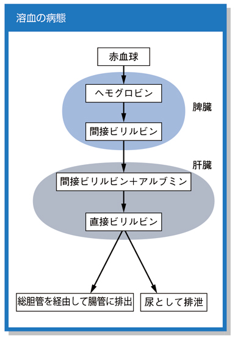

# 溶血

> 溶血は、赤血球が寿命より早く破壊される現象である。骨髄の赤血球産生で補えなくなると[[溶血性貧血]]をきたす。

## 要点

- 典型所見は[[網赤血球]]増加、[[LD]]上昇、[[間接ビリルビン]]上昇、尿・便中ウロビリノゲン増加、[[ハプトグロビン]]低下である。
- [[血管内溶血]]では血管内で赤血球が壊れ、[[ヘモグロビン尿]]やヘモジデリン尿を生じる。
- [[血管外溶血]]では脾臓・肝臓のマクロファージが赤血球を破壊し、黄疸や脾腫を生じやすい。
- 溶血を疑ったら[[Coombs試験]]を行い、免疫性溶血か非免疫性溶血かを鑑別する。
- 貧血は通常正球性で、骨髄では代償性に[[赤芽球過形成]]を認める。

赤血球の破壊で生じた[[間接ビリルビン]]はアルブミンと結合して肝臓へ運ばれ、抱合後に[[直接ビリルビン]]となって胆汁中へ排泄される。

## CBTチェック

- 貧血に[[網赤血球]]増加とLD上昇を伴えば、赤血球産生低下より[[溶血]]または出血を考える。溶血では間接ビリルビンも上昇する。
- [[Coombs試験|直接Coombs試験]]陽性なら[[自己免疫性溶血性貧血]]などの免疫性溶血を疑う。
- 血管内溶血では、遊離ヘモグロビンを結合する[[ハプトグロビン]]が低下する。
