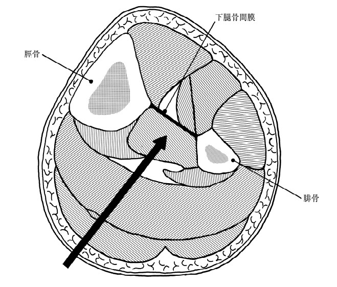

# 後脛骨筋

> **後脛骨筋（tibialis posterior）**は下腿深層後区画にある筋で、足関節の底屈と足の内反を行う。支配神経は脛骨神経である。

## 要点

- 起始：脛骨・腓骨の後面と下腿骨間膜。
- 走行：下腿深層を下行し、足関節内側では内果の後方を通る。
- 停止：主に舟状骨粗面など足部内側の骨。足部の内側縦アーチを支える。
- 作用：足関節の**底屈**、足の**内反**。支配神経は**脛骨神経**。
- 下腿深層後区画の筋 → 後脛骨筋、長趾屈筋、長母趾屈筋。後脛骨筋はこの区画で最も深い筋の一つ。

### 提示画像

下腿横断図で、脛骨・腓骨・下腿骨間膜に囲まれた深層後区画の中央部に後脛骨筋を示す（個人学習用、ユーザー提示画像）。

## CBTチェック

- 「底屈＋内反」→ 後脛骨筋を考える。
- 「下腿深層後区画＋脛骨神経」→ 後脛骨筋・長趾屈筋・長母趾屈筋を考える。
- 一言暗記：**後脛骨筋は底屈・内反、脛骨神経**。
