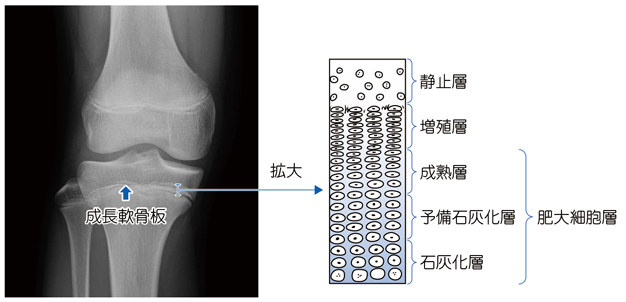

# 成長軟骨板

> 成長軟骨板（骨端線、physis）は長管骨の骨端と骨幹端の間にある軟骨組織で、軟骨内骨化による長軸方向の成長を担う。成長終了後は骨化して骨端線となる。

## 要点

- 骨端側から骨幹端側へ、静止層 → 増殖層 → 肥大細胞層（成熟層・予備石灰化層・石灰化層）の順に並ぶ。
- 増殖層では軟骨細胞が分裂して柱状に配列し、肥大・石灰化した軟骨基質が骨幹端側で骨に置換される。
- 成長ホルモン（GH）→ 肝臓などでのIGF-1産生 → 成長軟骨板の軟骨細胞増殖・肥大を促進し、長管骨を伸長させる。
- 成長軟骨板の損傷や早期閉鎖は、骨の短縮・変形の原因となる。

成長軟骨板の位置と層構造。骨端側から静止層、増殖層、成熟層、予備石灰化層、石灰化層が並ぶ（提示画像、個人学習用）。

## CBTチェック

- 「骨端と骨幹端の間」「長管骨の長さの成長」→ 成長軟骨板。
- 骨端側から「静止 → 増殖 → 肥大・成熟 → 石灰化」→ 成長軟骨板の配列。
- 「成長ホルモン」→ IGF-1を介して成長軟骨板を促進する。
