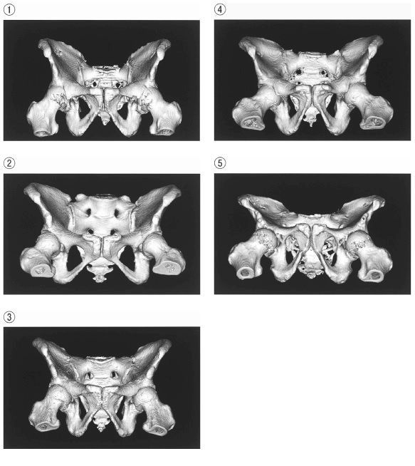

# 男女の骨盤比較

> 女性骨盤は分娩に適した形、男性骨盤は全体に狭く深い形を示す。正面像では恥骨下角と閉鎖孔が手掛かりになる。

## 要点

| 所見 | 女性 | 男性 |
| --- | --- | --- |
| 恥骨下角 | 鈍角・広い | 鋭角・狭い |
| 閉鎖孔 | 広く、比較的三角形 | 狭く、比較的円形 |
| 骨盤入口 | 横長・広い | 縦長・狭い |
| 腸骨翼 | 外側へ開く | 立ち上がりが強い |
| 仙骨 | 短く幅広い | 長く狭い |

提示画像（M3E問題280525293、個人学習用）。②は恥骨下角が鈍角で閉鎖孔が広く、女性骨盤に合う。

## CBTチェック

- 問題文の「恥骨下角が鈍角＋閉鎖孔が広い」→ 女性骨盤。
- 「恥骨下角が鋭角＋閉鎖孔が狭い」→ 男性骨盤。
- 骨盤形状は個体差があり、単一所見だけで性別を断定しない。
