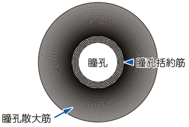

# 瞳孔の調節

> 瞳孔径は、虹彩の瞳孔括約筋（副交感神経）と瞳孔散大筋（交感神経）の収縮・弛緩で調節される。

## 要点

- 瞳孔括約筋：円周方向の平滑筋。副交感神経—動眼神経—毛様体神経節を介し、M3受容体刺激で収縮して縮瞳する。
- 瞳孔散大筋：放射状の平滑筋。交感神経のα1受容体刺激で収縮して散瞳する。
- トロピカミドやアトロピンはムスカリン受容体を遮断し、瞳孔括約筋を弛緩させて散瞳を起こす。
- ピロカルピンはムスカリン受容体を刺激し、縮瞳と毛様体筋収縮を起こす。急性閉塞隅角緑内障の治療に用いられることがある。
- 抗コリン薬による散瞳は、房水流出を妨げて急性閉塞隅角緑内障を誘発することがある。

瞳孔括約筋と瞳孔散大筋の配置（M3E 18300090、個人学習用）。

## CBTチェック

- 「瞳孔散大筋を収縮」→ 交感神経α1受容体。
- 「瞳孔括約筋を収縮」→ 副交感神経M3受容体。
- 「抗コリン薬」→ 散瞳・調節麻痺、急性閉塞隅角緑内障に注意。
