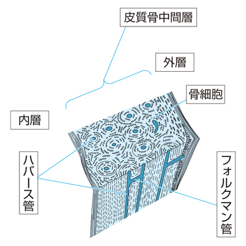

# 緻密骨

> 緻密骨（皮質骨）は骨の外側を構成する強固な骨組織で、骨単位（オステオン、ハバース系）を基本単位とする。

## 要点

- 骨単位は、中心のハバース管を同心円状の骨層板が取り囲む構造である。
- ハバース管は骨の長軸方向に走り、血管・神経を通す。
- フォルクマン管はハバース管と直交する方向に走り、骨膜・骨内膜側とハバース管を連絡する。
- 骨細胞は骨小腔に存在し、骨細管を介して周囲の骨細胞やハバース管と物質交換する。
- 外層・内層の周状層板は骨の外周・髄腔側を取り囲み、骨単位の間には介在層板が残る。

緻密骨の構造。ハバース管は縦方向、フォルクマン管はそれらを横方向に連絡する（提示画像、個人学習用）。

## CBTチェック

- 「同心円状の骨層板＋中央の管」→ 骨単位（オステオン、ハバース系）。
- 「長軸方向・血管」→ ハバース管。「横方向に連絡」→ フォルクマン管。
- 骨細胞は骨小腔、骨細管は骨細胞間・ハバース管との物質交換を担う。
