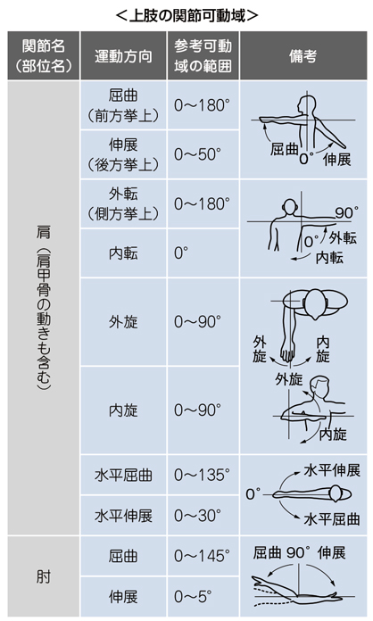
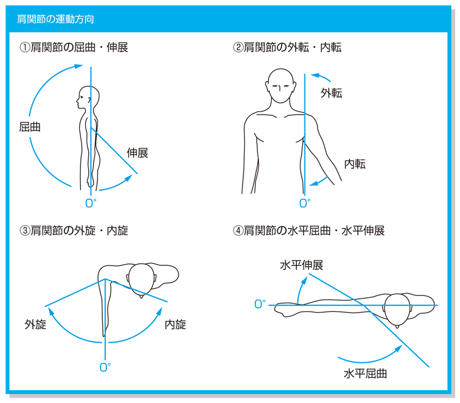

# 肩関節の運動と筋

> 肩甲上腕関節（肩関節）は多軸性の球関節で、屈曲・伸展、外転・内転、内旋・外旋を行う。

## 要点

|運動|主な作用筋|
|---|---|
|屈曲|前部三角筋、大胸筋鎖骨部、烏口腕筋、上腕二頭筋長頭|
|伸展|後部三角筋、広背筋、大円筋、上腕三頭筋長頭|
|外転|棘上筋（開始）→三角筋中部|
|内転|**広背筋**、大胸筋、大円筋|
|内旋|肩甲下筋、大胸筋、広背筋、大円筋、前部三角筋|
|外旋|棘下筋、小円筋、後部三角筋|

- [[前鋸筋]]：肩甲骨を外転（前方突出）・上方回旋し、胸郭へ固定する。[[僧帽筋]]と協働して肩関節の屈曲・外転による上肢挙上を支える。
- 前鋸筋は上腕骨を直接屈曲させる筋ではなく、肩甲骨を動かして屈曲位の保持に寄与する。支配神経は[[長胸神経]]（C5～C7；[肩周囲筋の支配神経](肩周囲筋の支配神経.md)）。
- [[菱形筋]]は肩甲骨の内転・下方回旋に働き、前鋸筋と対比する。前鋸筋麻痺では[[翼状肩甲]]と上肢挙上困難を生じる。

提示画像（M3E問題280525268、個人学習用）は肩・肘の基本的な関節可動域を示す。肩の挙上には肩甲骨の運動も関与する。

肩関節の屈曲・伸展、外転・内転、内旋・外旋、水平屈曲・水平伸展の方向を示す（提示画像、個人学習用）。

## CBTチェック

- 「内転－広背筋」→ 正しい。
- 棘上筋は外転開始、棘下筋・小円筋は外旋、肩甲下筋は内旋に働く。
- 問題文の「肩関節外転」→ 三角筋（主に中部）を考える。支配神経は腋窩神経。
- 問題文の「肩甲骨外転・上方回旋を伴う肩関節屈曲位保持」→ 前鋸筋を考える。
- 菱形筋・僧帽筋は主に肩甲骨を動かし、上腕三頭筋は肘関節伸展を行う。

![[Pasted image 20260821144643.png]]
