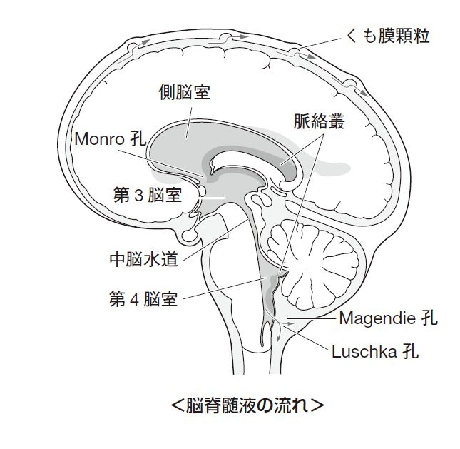

# 脳脊髄液の循環

> 脳脊髄液（cerebrospinal fluid：CSF）は主に脳室の脈絡叢で産生され、脳室系からくも膜下腔へ流れ、主にくも膜顆粒を介して静脈洞へ吸収される。

## 要点

- 流れ：側脳室 → Monro孔（室間孔）→ 第3脳室 → 中脳水道 → 第4脳室 → Magendie孔・Luschka孔 → くも膜下腔。
- くも膜下腔を脳・脊髄の表面に沿って循環し、くも膜顆粒から硬膜静脈洞へ戻る。
- 中脳水道は狭く、閉塞すると側脳室・第3脳室が拡大する非交通性水頭症をきたす。
- くも膜顆粒での吸収障害やくも膜下出血後の癒着では、交通性水頭症をきたす。
- CSFは脳・脊髄の浮力を保ち、外部からの衝撃を緩衝する。

脳脊髄液の産生部位と循環経路を示す模式図（個人学習用）。

## CBTチェック

- 「中脳水道狭窄」→ 側脳室・第3脳室の拡大を伴う非交通性水頭症。
- 「くも膜下出血後の水頭症」→ くも膜顆粒での吸収障害による交通性水頭症。
- CSFの流れは「側脳室→Monro→第3→中脳水道→第4→Luschka／Magendie→くも膜下腔」。
