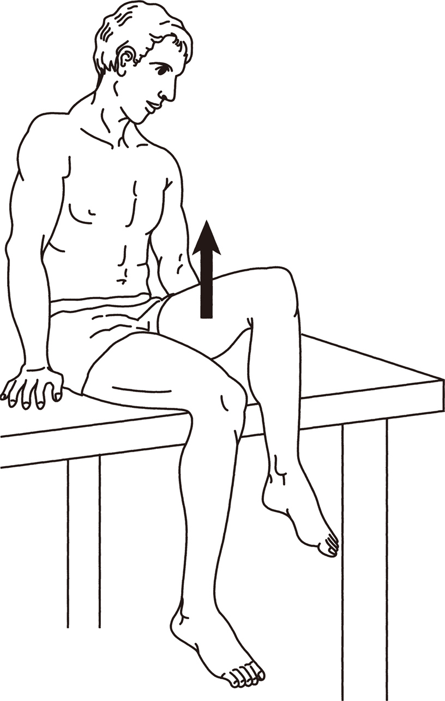

# 腸腰筋

> **腸腰筋（iliopsoas）**は大腰筋と腸骨筋からなり、股関節屈曲の主動作筋である。提示画像のように大腿を前方・上方へ挙上する動作で働く。

## 要点

- 構成：**大腰筋＋腸骨筋**。
- 起始：大腰筋は腰椎、腸骨筋は腸骨窩。両者は鼠径靱帯の下を通り、大腿骨小転子に停止する。
- 作用：股関節の**屈曲**。補助的に大腿の外旋にも関与する。
- 選択肢では腸腰筋（b）が正解。大腿直筋や縫工筋も股関節屈曲を補助するが、腸腰筋が主動作筋である。
- 中殿筋は主に股関節外転、大腿四頭筋は主に膝関節伸展、腹直筋は体幹屈曲に働く。

### 提示画像

座位で大腿を挙上する股関節屈曲の動作を示す（個人学習用、ユーザー提示画像）。

## CBTチェック

- 「股関節屈曲の主動作筋」→ **腸腰筋**。
- 「大腿を前方・上方へ挙上」→ 腸腰筋による股関節屈曲を考える。
- 一言暗記：**腸腰筋は股関節屈曲の主役**。
