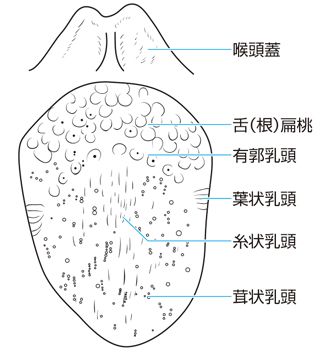

# 舌乳頭

> 舌背の乳頭は糸状・茸状・葉状・有郭乳頭の4種類である。**有郭乳頭は舌後方に逆V字状に並び、味蕾をもつ**。

> M3E CBT 問題番号18402400の解説図。個人学習用。

## 要点

- **有郭乳頭**：舌体と舌根の境界付近に逆V字状に7〜15個並ぶ。味蕾をもつ。
- **茸状乳頭**：舌尖・舌縁に散在する赤い乳頭で、味蕾をもつ。
- **葉状乳頭**：舌後方の側縁にあり、味蕾をもつ。ヒトでは発達が乏しい。
- **糸状乳頭**：舌背の大部分を覆い、角化してざらつきをつくる。味蕾をもたない。

## CBTチェック

- 「舌後方の逆V字状に並ぶ乳頭」→ **有郭乳頭**。
- 味蕾をもたない乳頭は**糸状乳頭**。
