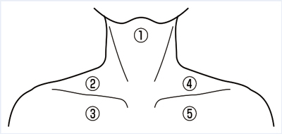

# Virchow転移

> **Virchow転移**は、消化器癌、特に[[胃癌]]が左鎖骨上窩リンパ節へ転移する所見である。胸管を経るリンパ行性転移を示唆する。

## 要点

- 左鎖骨上窩リンパ節は胸管の終末部近くにあり、胸部・腹部・骨盤からのリンパ流を受ける。
- 左鎖骨上窩リンパ節の硬い腫大（Troisier徴候）は、胃癌を含む消化器悪性腫瘍の進行を示唆する。
- 右鎖骨上窩リンパ節は、肺・食道など胸部病変との関連が重要である。
- Schnitzler転移は腹膜播種によるDouglas窩転移、Krukenberg転移は胃癌の卵巣転移である。

頸部リンパ節の位置。④が左鎖骨上窩リンパ節で、消化器癌のVirchow転移を考える。

出典：M3E CBT 問題番号18209150（個人学習用）

## CBTチェック

- 消化器癌 + 左鎖骨上窩リンパ節腫大 → Virchow転移。
- 右鎖骨上窩リンパ節腫大では、肺・食道など胸部悪性腫瘍も考える。
