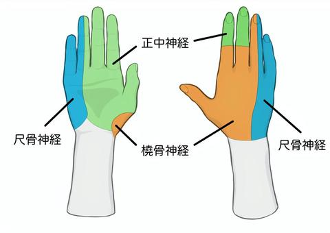

# 上肢末梢神経麻痺の鑑別

> 上肢の末梢神経麻痺は、感覚領域だけでなく**できなくなった運動**から障害神経を絞る。橈骨・正中・尺骨神経の代表所見を対比する。

## 要点

| 神経 | 主な運動障害 | 主な感覚障害 |
|---|---|---|
| [[橈骨神経麻痺]] | 手関節・手指・母指の伸展不能 → **下垂手** | 手背橈側、特に母指－示指間 |
| [[正中神経麻痺]] | 母指対立・外転障害、母指球萎縮 → 猿手 | 掌側の母指〜環指橈側半分 |
| [[尺骨神経麻痺]] | 手指内外転障害、環・小指の鉤爪変形 → 鷲手 | 小指と環指尺側半分 |

- 上腕を長時間圧迫した後の下垂手は、上腕骨橈骨神経溝付近の橈骨神経圧迫を考える。
- 後骨間神経麻痺では手指伸展が障害されるが、感覚障害は伴わない。

正中・尺骨・橈骨神経の代表的な感覚支配領域（ユーザー提示画像、個人学習用）。障害神経は感覚分布だけで決めず、運動所見と合わせて判断する。

## CBTチェック

- 手関節・母指・示指を**伸展できない**ことが橈骨神経麻痺を示す決め手（M3E 18302590）。
- 母指・示指のしびれだけで正中神経麻痺と決めず、手背か掌側か、伸展か対立かを確認する。
- 下垂手＝橈骨神経、猿手＝正中神経、鷲手＝尺骨神経。
