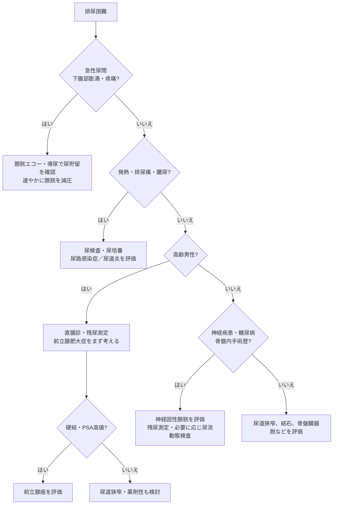

# 排尿困難の鑑別

> **排尿困難**は、尿勢低下、排尿開始遅延、腹圧排尿、尿線途絶、残尿感などを指す。原因は、尿路の通過障害と膀胱収縮障害に大別する。

## 鑑別の要点

- 高齢男性では[[前立腺肥大症]]が最も多い。直腸診で前立腺の大きさ・硬さを評価し、必要に応じてPSAで[[前立腺癌]]を評価する。
- 若年者、尿道カテーテル・外傷・性感染症の既往では、[[尿道狭窄症]]や[[淋菌性尿道炎]]を考える。
- [[糖尿病]]、脊髄疾患、骨盤内手術歴、神経症状があれば[[神経因性膀胱]]を考える。
- 女性では骨盤臓器脱、膀胱瘤、術後変化などによる尿道・膀胱出口の閉塞を考える。
- 発熱、排尿痛、膿尿・細菌尿を伴えば尿路感染症を、血尿を伴えば尿路結石・腫瘍も考える。

## フローチャート

## CBTチェック

- 高齢男性の排尿困難では、まず[[前立腺肥大症]]を考え、**直腸診**を行う。
- 「尿が出ない + 下腹部膨満・疼痛」は[[尿閉]]であり、導尿による膀胱減圧を急ぐ。
- 排尿困難に神経症状や残尿が加われば、[[神経因性膀胱]]を疑う。
