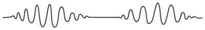
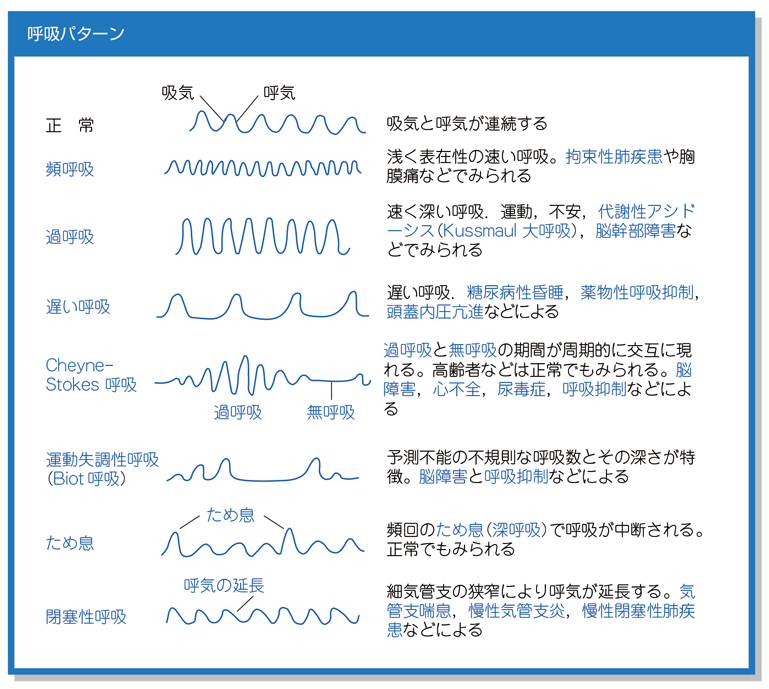

# 異常呼吸パターン

> 呼吸の深さ・速さ・規則性の変化から、代謝性疾患や中枢神経障害、気道閉塞を推定する。

## 要点

| 呼吸 | 典型的な特徴・関連 |
| --- | --- |
| **Cheyne–Stokes呼吸** | 呼吸が徐々に深く・速くなった後に浅くなり、無呼吸を周期的に繰り返す。大脳皮質下・間脳障害、心不全など。 |
| **Kussmaul呼吸** | 持続する深く大きい呼吸。糖尿病性ケトアシドーシスなどの代謝性アシドーシス。 |
| **Biot呼吸（失調性呼吸）** | 不規則な呼吸と無呼吸が混在。延髄などの障害、頭蓋内圧亢進でみられる。 |
| **中枢性過換気** | 持続性の深く速い過換気。中脳下部〜橋上部の障害。 |
| **閉塞性呼吸** | 気道閉塞により呼気が延長し、喘鳴を伴うことがある。 |

Cheyne–Stokes呼吸は、呼吸中枢へのフィードバック遅延や循環時間延長などにより、過換気期と無呼吸期が交互に現れる。

### 波形（提示画像、個人学習用）

M3E CBT問題279933166の提示波形。呼吸の漸増・漸減と無呼吸の周期性がCheyne–Stokes呼吸を示す。

異常呼吸パターンの一覧（提示画像、個人学習用）。頻呼吸・過呼吸・遅い呼吸・ため息呼吸・運動失調性呼吸なども併記されている。

## CBTチェック

- 深く大きい呼吸＋代謝性アシドーシス → Kussmaul呼吸。
- 漸増・漸減する呼吸＋無呼吸の反復 → Cheyne–Stokes呼吸。
- 呼気延長 → 閉塞性呼吸（喘息・COPDなど）。
