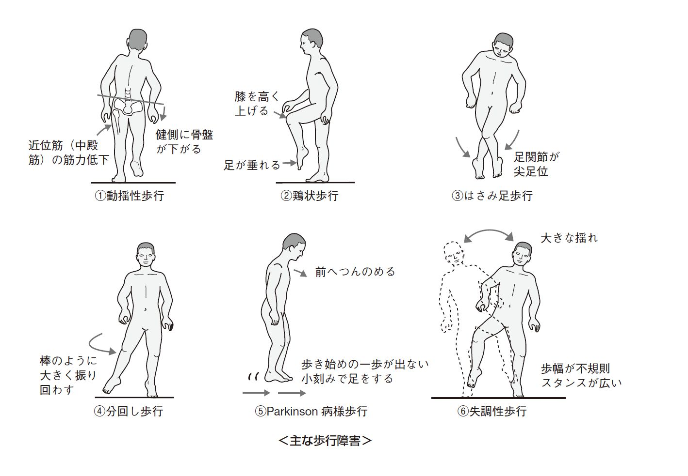

# 異常歩行

> 異常歩行は、まず「筋力低下」「錐体路障害」「大脳基底核・小脳障害」の3群に分けると、障害部位と歩容を結びつけやすい。

## 要点

|グループ|主な障害部位|代表的な歩行|
|---|---|---|
|筋力低下|中殿筋、前脛骨筋など|動揺性歩行、鶏歩|
|錐体路障害|上位運動ニューロン|はさみ歩行、ぶん回し歩行|
|大脳基底核・小脳障害|錐体外路・小脳|Parkinson病様歩行、失調性歩行|

- **動揺性歩行**：中殿筋が弱い → 立脚側で骨盤を支えられない → 健側骨盤が下がる。体幹を患側へ傾けて代償する。
- **鶏歩**：前脛骨筋（深腓骨神経）が麻痺 → 下垂足 → つま先を引っかけないよう膝を高く上げる。総腓骨神経麻痺でみられる。
- **はさみ歩行**：両側の内転筋群が痙縮 → 両下肢が交差する。脳性麻痺などの痙性対麻痺でみられる。
- **ぶん回し歩行**：片側下肢が痙縮して膝を曲げにくい → 下肢を外側へ半円状に振り出す。脳卒中後片麻痺で代表的。
- **Parkinson病様歩行**：大脳基底核障害 → 動作開始困難（すくみ足）と前方突進 → 前傾・小刻み歩行・上肢の振りの減少。
- **失調性歩行**：小脳障害 → 運動の精度・平衡を調整できない → 開脚で、歩幅・方向が不規則にふらつく。
- **感覚性失調**：深部覚障害 → 視覚での代償がなくなる閉眼時にふらつきが増強 → [[感覚性失調とRomberg徴候|Romberg徴候]]陽性。

主要な異常歩行の比較（提示画像、個人学習用）。

## CBTチェック

- 「骨盤が健側に下がる」→ 中殿筋麻痺による動揺性歩行。「膝を高く上げる」→ 鶏歩。
- 「両下肢が交差」→ はさみ歩行。「片側下肢を外側へ振る」→ ぶん回し歩行。
- 「すくみ足・小刻み・前傾」→ [[Parkinson病]]。「開脚・ふらつき・歩幅不規則」→ 小脳性失調。
