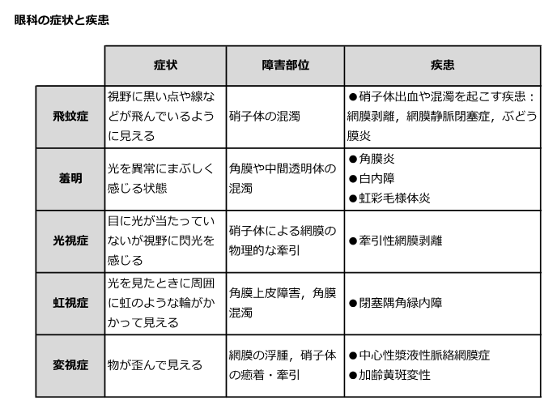
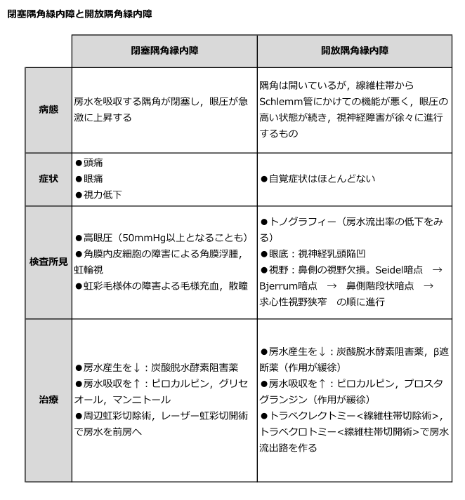

# 眼症状の鑑別

> 眼症状は、見え方の異常と眼痛・充血の有無から障害部位を絞る。**突然の飛蚊症・光視症**は網膜裂孔・剝離を、**虹視＋眼痛・頭痛・嘔吐**は[[急性閉塞隅角緑内障]]を優先して除外する。

## 症状からの鑑別

| 症状 | 見え方・機序 | CBTで重要な疾患 |
| --- | --- | --- |
| 飛蚊症 | 黒い点・糸が動いて見える／硝子体混濁 | [[網膜裂孔]]・[[網膜剝離]]、[[硝子体出血]]、[[ぶどう膜炎]] |
| 羞明 | 光を異常にまぶしく感じる／角膜・中間透光体の障害 | [[角膜炎]]、[[白内障]]、[[虹彩毛様体炎]] |
| 光視症 | 光がないのに閃光を感じる／硝子体による網膜牽引 | [[網膜裂孔]]・[[網膜剝離]] |
| 虹視症 | 光源の周囲に虹色の輪／角膜浮腫 | [[急性閉塞隅角緑内障]] |
| 変視症 | 線や物が歪んで見える／黄斑部障害 | [[加齢黄斑変性]]、[[中心性漿液性脈絡網膜症]] |

急に増えた飛蚊症・光視症に視野のカーテン状欠損を伴えば、網膜裂孔・剝離を疑い緊急に眼底を評価する。

## 緑内障の鑑別

| 項目 | 閉塞隅角 | 開放隅角 |
| --- | --- | --- |
| 隅角・機序 | 虹彩が隅角を閉塞；急性発作は瞳孔ブロックが典型 | 隅角は開放；線維柱帯で房水流出抵抗が増大 |
| 経過・症状 | 急激な眼痛、頭痛、視力低下、虹視、悪心・嘔吐 | 慢性に進行し、自覚症状に乏しい |
| 代表所見 | 高眼圧、角膜浮腫、毛様充血、浅前房、中等度散瞳 | 視神経乳頭陥凹、鼻側階段・弓状暗点などの視野障害 |
| 検査上の注意 | 発作中は散瞳眼底検査を行わない | 眼圧が正常でも[[緑内障]]を否定できない |
| 治療の軸 | 緊急に眼圧下降後、レーザー虹彩切開術 | 眼圧下降点眼、レーザー線維柱帯形成術・手術 |

- **急性＋眼痛・嘔吐・浅前房**は閉塞隅角、**慢性＋無症候・視野障害**は開放隅角。
- 閉塞隅角発作の機序は瞳孔ブロックであり、単なる房水産生過多ではない。
- 正常眼圧でも開放隅角緑内障は起こりうるため、視神経乳頭と視野を評価する。
