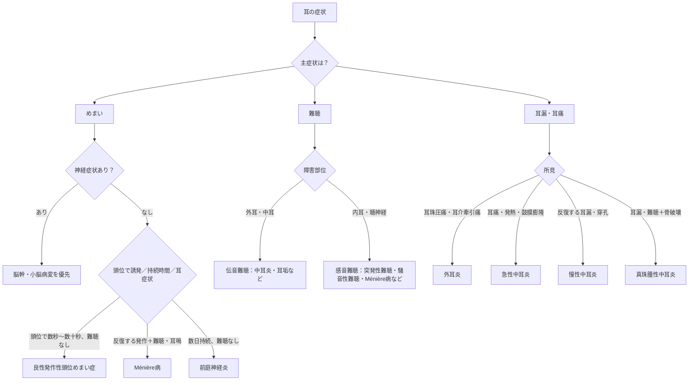

# 耳鼻科：症状から考える鑑別まとめ

> 耳の症状は、**症状 → 障害部位（外耳・中耳／内耳・前庭）→ 発症様式 → 付随症状**の順に整理する。めまいでは中枢性を最初に除外する。

## フローチャート

## 症状別要点

- **めまい＋構音障害・複視・麻痺・強い体幹失調**は中枢性めまいを疑い、脳卒中の評価を優先する。耳症状を伴う反復性めまいは[[メニエール病|Ménière病]]、頭位誘発の短時間めまいは[[良性発作性頭位めまい症]]、持続性で難聴がない場合は[[前庭神経炎]]を考える。
- 難聴は、外耳・中耳障害による**伝音難聴**と、内耳・聴神経障害による**感音難聴**に分ける。突然の一側性感音難聴は[[突発性難聴]]を考える。
- 耳痛・発熱・鼓膜膨隆は[急性中耳炎](../03_疾患/耳鼻咽喉科/急性中耳炎.md)、耳痛が乏しく中耳貯留液と難聴を認めれば[[滲出性中耳炎]]、耳漏・難聴に骨破壊を伴えば[[真珠腫性中耳炎]]を考える。
- Rinne試験は伝音難聴で陰性（骨導＞気導）、Weber試験は伝音難聴で患側、感音難聴で健側へ偏る。

## CBTチェック

- **秒＋頭位変換** → 良性発作性頭位めまい症、**時間＋耳症状の反復** → Ménière病、**日＋難聴なし** → 前庭神経炎。
- 耳珠圧痛は外耳炎、鼓膜穿孔を伴う反復耳漏は[慢性中耳炎](../03_疾患/耳鼻咽喉科/慢性中耳炎.md)、骨破壊は真珠腫性中耳炎を示唆する。
- 詳細は[めまいの鑑別](めまいの鑑別.md)と[中耳炎の鑑別](../03_疾患/耳鼻咽喉科/中耳炎の鑑別.md)を参照する。
