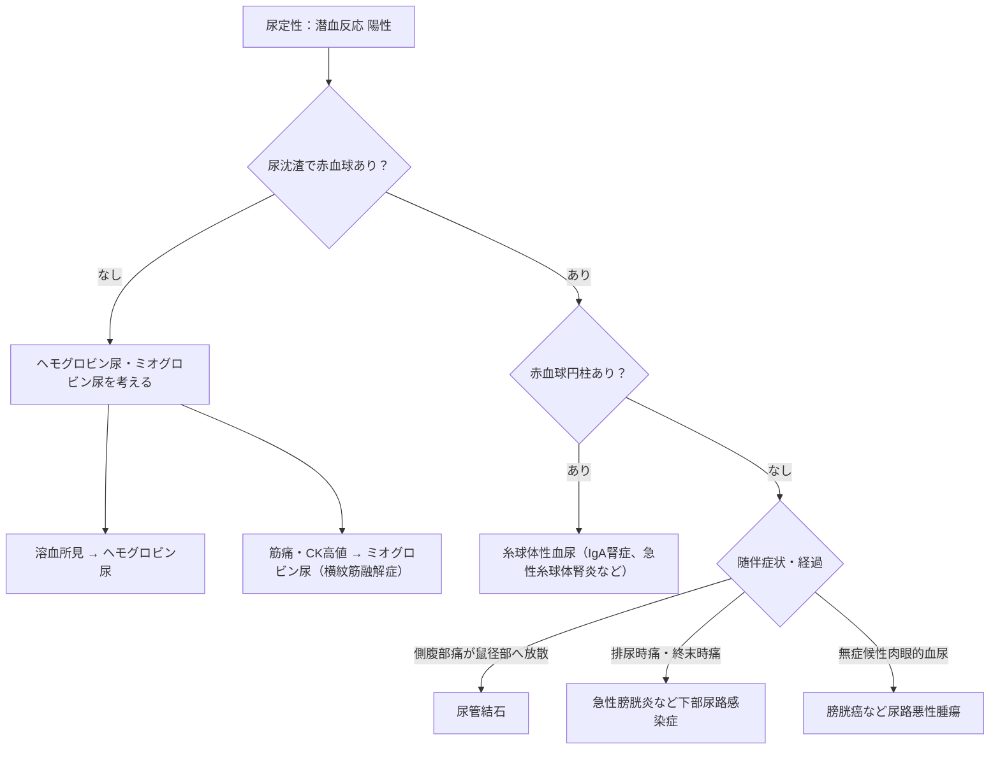

# 血尿の鑑別

> 尿定性の潜血反応は、赤血球だけでなくヘモグロビン・ミオグロビンにも反応する。潜血陽性時は、まず尿沈渣で赤血球の有無と円柱を確認する。

## フローチャート

## 要点

- 尿試験紙の潜血反応陽性だけでは血尿と確定できない。RBC陰性なら、溶血によるヘモグロビン尿、または[[横紋筋融解症]]によるミオグロビン尿を考え、血液検査（CK、溶血所見）で確認する。
- RBC円柱、蛋白尿、変形赤血球は糸球体性の病変を示唆し、[[IgA腎症]]・[[急性糸球体腎炎]]などを考える。赤色尿や潜血反応陽性だけでは糸球体性と判定できない。
- [[IgA腎症]]では持続性の顕微鏡的血尿に加え、上気道・扁桃の炎症と**同時期〜数日後**に肉眼的血尿を反復することがある。蛋白尿・赤血球円柱を伴い、補体価は通常保たれる。
- [[急性糸球体腎炎]]は溶連菌感染後**1〜3週**の時間差、浮腫・高血圧、補体低下が鑑別点となる。
- 放散する側腹部痛は[[尿管結石]]、排尿時痛・終末時痛は[[急性膀胱炎]]などの下部尿路病変を示唆する。
- 無症候性の肉眼的血尿では[[膀胱癌]]を含む尿路悪性腫瘍を除外する。血尿が間欠的でも否定しない。

## CBTチェック

- 「潜血反応＋、RBC－、CK高値」はミオグロビン尿であり、[[横紋筋融解症]]を疑う。
- 「潜血反応＋、RBC円柱＋」は糸球体性血尿を考える。
- 「感冒・扁桃炎と同時期の肉眼的血尿＋補体正常」はIgA腎症を考える。
- 「無痛性肉眼的血尿」は膀胱癌を疑う典型像である。
