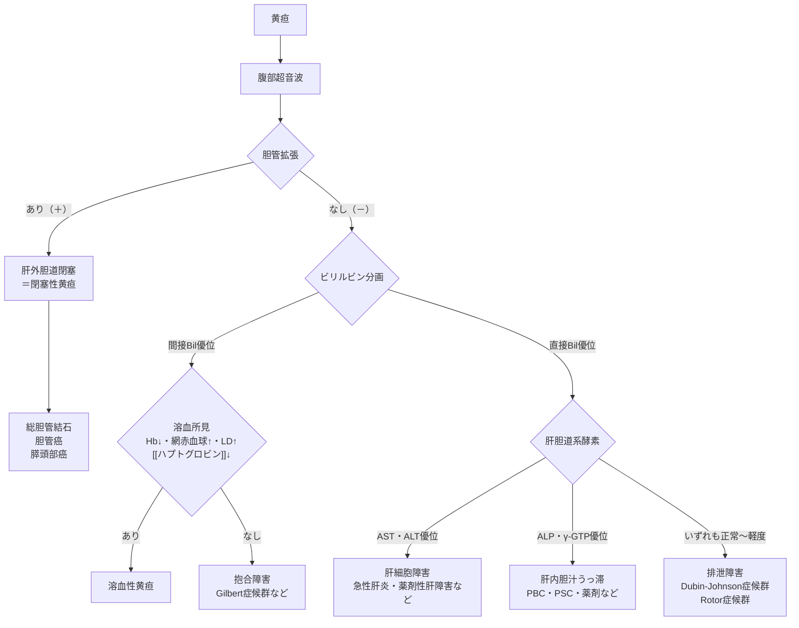
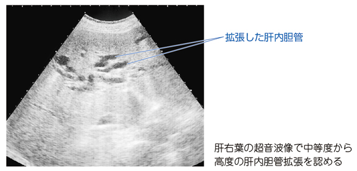

# 黄疸の鑑別

> [[黄疸]]では、腹部超音波による胆管拡張の有無と、直接・[[間接ビリルビン]]、AST・ALT、ALP・γ-GTPのパターンから原因を絞る。

## 鑑別フローチャート

- 胆管拡張を認める場合は、[[総胆管結石]]・[[胆管癌]]・[[膵頭部癌]]などの肝外胆道閉塞を考える。
- 肝外胆道閉塞では、直接ビリルビン優位、尿ビリルビン陽性、尿ウロビリノゲン陰性、白色便を認める。
- 胆汁が腸管へ届かないと[脂溶性ビタミン](../01_基礎医学/生化学/脂溶性ビタミン.md)（A・D・E・K）の吸収が低下する。特に[ビタミンK欠乏症](../03_疾患/血液/ビタミンK欠乏症.md)によるPT延長・出血傾向が重要である。

肝内胆管の拡張を示す腹部超音波像。黄疸を伴うときは閉塞性黄疸を考え、[内視鏡的逆行性胆管膵管造影（ERCP）](../04_検査/画像/内視鏡的逆行性胆管膵管造影（ERCP）.md)などで閉塞部位を評価する。

出典：M3E CBT 問題番号18105010（個人学習用）

- 胆管拡張がなく直接ビリルビン優位なら、AST・ALT優位の肝細胞障害と、ALP・γ-GTP優位の肝内胆汁うっ滞を分ける。
- 直接ビリルビン優位でも肝胆道系酵素がほぼ正常なら、[[Dubin-Johnson症候群]]・[[Rotor症候群]]などを考える。
- 間接ビリルビン優位では、まず[[溶血]]所見を確認する。溶血がなければ[[Gilbert症候群]]などの抱合障害を考えるが、**分画だけで肝機能が正常とは判断しない**。
- 超音波で胆管拡張がなくても、早期・間欠的な胆道閉塞は完全には否定できない。

## CBTチェック

- 胆管拡張あり＋直接ビリルビン・ALP・γ-GTP上昇 → 閉塞性黄疸。
- 白色便＋尿ビリルビン陽性＋尿ウロビリノゲン陰性 → 胆道閉塞を考える。
- 閉塞性黄疸 → 胆汁酸不足による脂肪吸収障害 → ビタミンK欠乏・PT延長。
- 間接ビリルビン＋LD・網赤血球上昇＋ハプトグロビン低下 → 溶血。
- 孤立性の間接ビリルビン上昇＋肝酵素・溶血所見正常 → [[Gilbert症候群]]。
- 発熱・右季肋部痛・黄疸（Charcot三徴）では[[急性胆管炎]]を疑い、緊急評価する。
