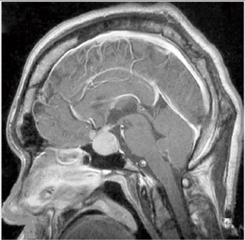

# 下垂体腺腫

> 下垂体腺腫は下垂体前葉由来の腫瘍で、ホルモンを過剰分泌する機能性腺腫と、圧迫症状を主体とする非機能性腺腫がある。巨大化して鞍上部へ進展すると視交叉を圧迫し、両耳側半盲をきたす。

## 要点

- MRIでトルコ鞍内から鞍上部へ進展する腫瘤として確認する。
- 視交叉の圧迫 → 両耳側半盲（両眼の外側視野欠損）。
- 機能性腺腫の代表はプロラクチン産生腺腫、成長ホルモン産生腺腫、ACTH産生腺腫である。
- 10 mm以上を[[下垂体巨大腺腫]]（macroadenoma）と呼ぶ。腺腫の評価では視野検査と下垂体ホルモンの確認も行う。

矢状断MRIでトルコ鞍から鞍上部へ進展する腫瘤を示す（M3E 18201000、個人学習用）。

## CBTチェック

- 問題文の「トルコ鞍〜鞍上部の腫瘍」＋「両耳側半盲」→ 視交叉を圧迫する下垂体腺腫を考える。
- 視交叉病変＝両耳側半盲、視索以後の病変＝同名半盲。
- 鞍上部腫瘍の鑑別には[[頭蓋咽頭腫]]や胚細胞腫瘍もある。頭蓋咽頭腫は石灰化・囊胞形成が手掛かりになる。
