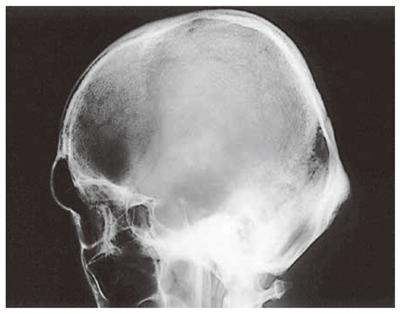

# 先端巨大症

> **先端巨大症**は、骨端線閉鎖後の成長ホルモン（GH）過剰により、手足・顔面などの末端部と軟部組織が肥大する疾患である。多くは下垂体GH産生腺腫による。

## 要点

- 骨端線閉鎖後は身長ではなく、手足の肥大、眉弓部膨隆、下顎前突、前額突出などを来す。
- 大きな下垂体腺腫は頭痛、視交叉圧迫による**両耳側半盲**をきたす。頭部X線ではトルコ鞍拡大を認めうる。

トルコ鞍の拡大を示す側面頭部X線。

出典：M3E CBT 問題番号18403963（ユーザー提示、個人学習用）

- GH・IGF-1過剰により、糖尿病、高血圧、心肥大、[[睡眠時無呼吸症候群]]、[[手根管症候群]]を合併しうる。
- 診断はIGF-1高値を確認し、75 g経口ブドウ糖負荷でGHが抑制されないこと、下垂体MRIで評価する。
- 第一選択は経蝶形骨洞手術で、薬物療法にはソマトスタチンアナログ、ドパミンアゴニスト、GH受容体拮抗薬を用いる。
- 治療によりGH・IGF-1（ソマトメジンC）が低下すると、軟部組織の肥厚は改善する。

## CBTチェック

- 骨端線閉鎖**前**のGH過剰は[[下垂体性巨人症]]、閉鎖**後**は先端巨大症。
- 手・足のサイズ増大と特徴的顔貌をみたら先端巨大症を考える。
- 下垂体腺腫が視交叉を圧迫 → **両耳側半盲**。
- 「トルコ鞍の変形・拡大」＋「血清ソマトメジンC高値」→ 先端巨大症を考える。GH単独高値だけでは確定しない。
- 先端巨大症では、TRH負荷でGHが逆説的に増加することがある。末節骨の肥大や軟部組織肥厚による[[手根管症候群]]もみられる。
