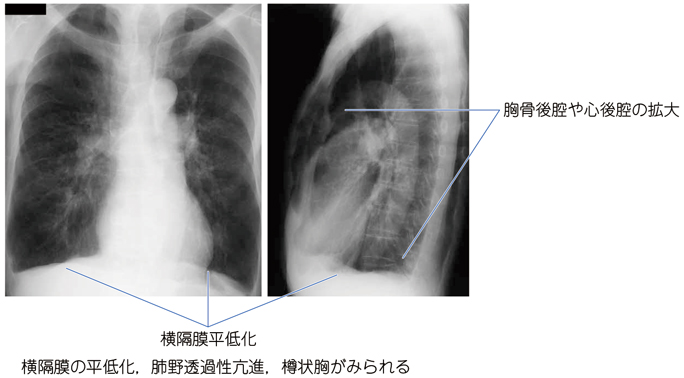
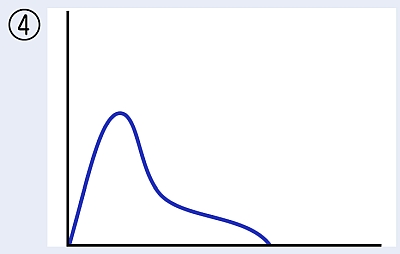

# COPD（慢性閉塞性肺疾患）

> 主に喫煙による気道・肺胞の慢性炎症で、**持続する気流閉塞**を生じる疾患である。慢性の咳・痰と労作時呼吸困難をきたす。

## 要点

- 最大の危険因子は喫煙で、気腫型では肺胞壁破壊 → 肺過膨張を生じる。
- 症候は慢性咳嗽、喀痰、進行性の労作時呼吸困難で、増悪時には膿性痰が増える。
- 身体所見は樽状胸、呼気延長、喘鳴、口すぼめ呼吸、補助呼吸筋（胸鎖乳突筋）の発達である。
- 胸部X線では肺野透過性亢進、横隔膜平低化を認め、確定診断には[[スパイロメトリ]]を行う。
- 気管支拡張薬後の1秒率（FEV₁/FVC）**70％未満**が持続性気流閉塞の基準である。

肺過膨張による横隔膜平低化と胸骨後腔の拡大を示す胸部X線像。

閉塞性換気障害では、最大呼気流量低下により呼気側が下に凹む。

出典：M3E CBT 問題番号18303861〜18303864（ユーザー提示、個人学習用）

## CBTチェック

- 喫煙歴＋咳・痰＋労作時呼吸困難 → COPDを疑い、まずスパイロメトリで閉塞性換気障害を確認する。
- ％VCが保たれ、1秒率が低下 → **閉塞性換気障害**。フローボリューム曲線の呼気側は下に凹む。
- COPDで典型的なのは樽状胸・呼気延長であり、匙状爪は[[鉄欠乏性貧血]]を示唆する。
