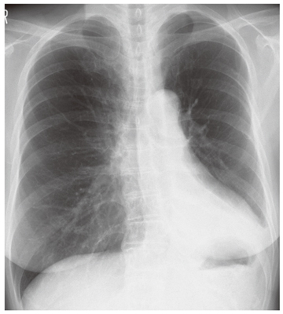

# 無気肺

> **無気肺（atelectasis）**は、肺または肺葉の一部が虚脱し、肺容量が低下した状態である。気道閉塞、圧迫、浅い呼吸などが原因となる。

## 要点

- 胸部X線では、病変部の透過性低下に加えて、葉間裂の偏位、血管・気管支の crowding、同側横隔膜挙上など「容量減少」の所見をみる。
- 左下葉無気肺では、心陰影の後方・左下肺野の陰影、左横隔膜挙上などが手掛かりになる。
- 原因は粘液栓・腫瘍・異物などの気道閉塞、胸水・気胸などによる圧迫、術後の浅呼吸などである。
- 広範囲では低酸素血症をきたし、原因検索には胸部CTや気管支鏡を用いることがある。

画像：左下葉の容量減少と左横隔膜挙上を示唆する胸部X線（M3E問題280516275、ユーザー提示・個人学習用）。

## CBTチェック

- 問題文・画像の「肺容量減少＋葉間裂偏位／同側横隔膜挙上」→ 無気肺を考える。
- 左下葉無気肺は心陰影の後方（retrocardiac）に陰影が出やすい。
