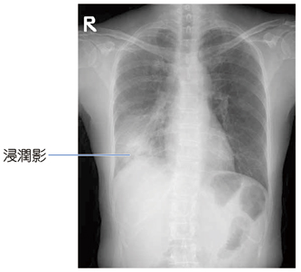
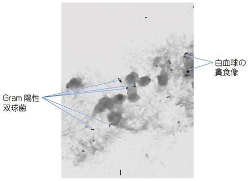

# 肺炎球菌性肺炎

> **肺炎球菌性肺炎**は、莢膜をもつGram陽性双球菌である[[肺炎球菌]]（*Streptococcus pneumoniae*）による代表的な[[市中肺炎]]である。

## 要点

- 急な発熱、咳、膿性痰、胸膜痛を呈し、患部で断続性ラ音（crackles）を聴取することがある。
- 胸部X線では区域性・大葉性の浸潤影やコンソリデーションを認める。
- 良質な喀痰の[[グラム染色]]で、好中球に貪食された**Gram陽性のランセット状双球菌**を多数認めれば強く示唆される。
- 喀痰培養では起炎菌の同定と薬剤感受性を確認する。尿中肺炎球菌抗原も補助診断に用いる。
- 重症度や耐性リスクに応じて、ペニシリン系・セフェム系などのβラクタム系[[抗菌薬]]を選択する。

右下肺野に浸潤影を認める。画像所見のみでは起炎菌を確定できない。

喀痰Gram染色で、白血球に貪食されたGram陽性双球菌を認める。

## CBTチェック

- 市中肺炎＋喀痰中の好中球内Gram陽性双球菌は[[肺炎球菌]]を示唆する。
- 膿性痰が得られた場合、喀痰Gram染色は迅速な起炎菌推定に有用である。
- 抗酸菌染色、尿中レジオネラ抗原、咽頭インフルエンザ検査は、それぞれの感染症を疑う場合に選択する。
