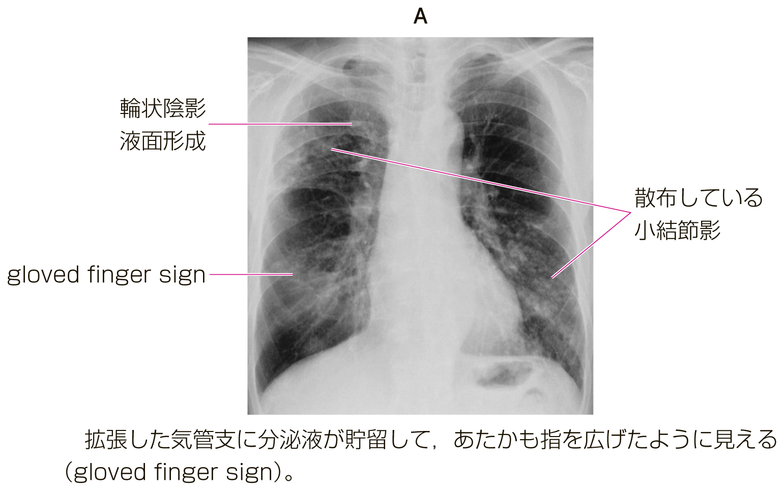
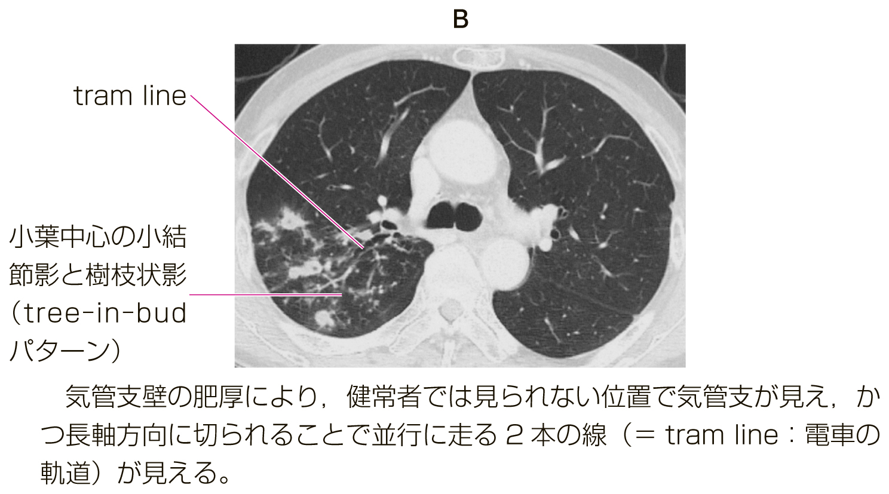
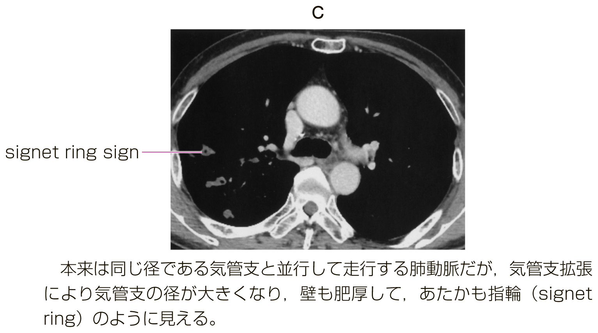

# 非結核性抗酸菌症

> 結核菌群以外の抗酸菌による感染症で、肺病変では **Mycobacterium avium complex（MAC）** が大部分を占める。高齢者、とくに基礎肺疾患のない中高年女性にもみられる。

## 要点

- 主な菌種はMAC（*M. avium*、*M. intracellulare*）。ほかに *M. kansasii*、難治性の *M. abscessus* などがある。
- 画像病型は、①結節・気管支拡張型、②線維空洞型、③空洞を伴う結節・気管支拡張型などに整理される。空洞性病変は進行・予後不良のリスクである。
- 結節・気管支拡張型では中葉・舌区を中心に小結節、分枝状陰影（tree-in-bud）、気管支拡張をみる。
- 線維空洞型では上葉優位の空洞・線維化をみやすく、陳旧性肺結核や[COPD](COPD.md)などの基礎肺疾患を伴うことが多い。
- 診断は症状、胸部X線/CTの特徴的所見、喀痰などからの菌学的証明を組み合わせて行う。画像だけで確定しない。

### 結核との鑑別

- 抗酸菌が検出された時点では、結核菌群か非結核性抗酸菌かを同定するまで区別できない。まず喀痰の抗酸菌塗抹・培養に加え、結核菌核酸増幅（PCR）検査を行う。
- 結核菌感染が確定した場合は、[感染症法](../../07_公衆衛生・法医学/感染症対策/感染症法.md)に基づく保健所への届出と、接触者・空気感染対策を検討する。結核が確定する前に抗結核薬を漫然と開始しない。
- IGRA（インターフェロンγ遊離試験）は結核感染の補助検査であり、活動性結核と潜在性結核感染の区別や感染時期の特定はできない。
- 患者にはサージカルマスク、医療従事者には状況に応じてN95マスクを用いる。診断・治療の詳細は[[肺結核]]を参照する。

### 画像所見（提示画像、個人学習用）

以下はM3E CBT問題279933153で提示された画像を、個人学習用に保存したもの。

結節・気管支拡張型：小結節の散布、気管支拡張、分泌物貯留による **gloved finger sign**。

小葉中心性小結節と樹枝状影（tree-in-bud）、気管支壁肥厚による **tram line**。

気管支拡張により、並走する肺動脈と気管支が指輪状にみえる **signet ring sign**。

## CBTチェック

- 高齢女性＋中葉・舌区の小結節・気管支拡張 → MACの結節・気管支拡張型。
- 上葉優位の空洞＋基礎肺疾患 → 線維空洞型を考える。
- NTMは結核菌ではないため、診断・治療は結核と区別して考える。
