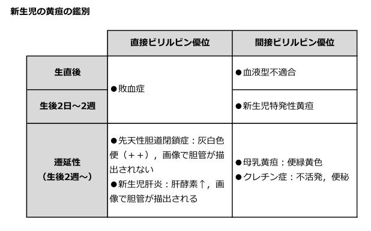

# 新生児黄疸：生理的黄疸・早期黄疸・遷延性黄疸

> 新生児黄疸は発症時期、上昇速度、直接・間接[[ビリルビン]]分画で評価する。**生後24時間以内の早期黄疸**と、正期産児で**生後2週間以上続く遷延性黄疸**は病的原因を検索する。

## 要点

| 種類 | 時間経過・分画 | 対応の要点 |
|---|---|---|
| 生理的黄疸 | 生後24時間以降に出現し、生後3〜5日にピーク、正期産児では通常2週間以内に軽快する。[[間接ビリルビン]]優位 | 全身状態と総ビリルビンを経時的に評価する |
| 早期黄疸 | 生後24時間以内に出現する可視黄疸。急速な上昇も病的黄疸を疑う | [[新生児溶血性疾患]]（ABO・Rh不適合）、頭血腫、感染症などを検索する |
| 遷延性黄疸 | 正期産児で生後2週間以上持続する黄疸 | 直接・間接ビリルビンを分画し、[[母乳性黄疸]]と胆汁うっ滞性疾患を鑑別する |

- 生理的黄疸は、赤血球量が多いこと、赤血球寿命が短いこと、肝のUDP-グルクロン酸転移酵素1A1（UGT1A1）活性が低いこと、腸肝循環が亢進しやすいことによる。血清アルブミン値は主な成因ではない。
- 遷延性黄疸では、総・直接ビリルビンを測定して分画する。**直接ビリルビン優位は生理的黄疸ではない**ため、[[胆道閉鎖症]]などの胆汁うっ滞を急いで評価する。
- 間接ビリルビン優位で、哺乳・体重増加が良好なら[[母乳性黄疸]]が多い。ただし、[[新生児溶血性疾患]]、[[先天性甲状腺機能低下症]]、[[Crigler-Najjar症候群]]も鑑別する。
- 灰白色便、濃い尿、肝腫大、全身状態不良は、胆汁うっ滞や肝疾患を示唆する。これらは[[Gilbert症候群]]や母乳性黄疸の典型像ではない。

提示図は分画と発症時期による鑑別の整理に用いる（実際の評価では便色、尿色、全身状態、検査値を合わせて判断する）。

## CBTチェック

- **生後24時間以内**の黄疸は生理的とは考えず、まず溶血を含む病的黄疸を疑う。Rh不適合妊娠では母体IgG抗体が胎盤を通過し、胎児・新生児の溶血を起こす。
- **生後2週間以上**の遷延性黄疸では、総ビリルビンだけでなく直接・間接ビリルビンを確認する。
- 母乳性黄疸は間接ビリルビン優位、[[胆道閉鎖症]]は直接ビリルビン優位で、灰白色便が重要な手がかりである。
- 「間接ビリルビン優位」だけで[[Gilbert症候群]]とは決めない。溶血・甲状腺機能低下・遺伝性抱合障害を除外する。

参考資料：[日本産科婦人科学会「産婦人科診療ガイドライン産科編」](https://www.jsog.or.jp/activity/publication/pdf/sanka_gl2026_pc3.pdf)、[AAP「Management of Hyperbilirubinemia in the Newborn Infant 35 or More Weeks of Gestation」](https://publications.aap.org/pediatrics/article/150/3/e2022058859/188726/Clinical-Practice-Guideline-Revision-Management-of)、[厚生労働省「胆道閉鎖症」](https://www.mhlw.go.jp/file/06-Seisakujouhou-10900000-Kenkoukyoku/0000085577.pdf)
