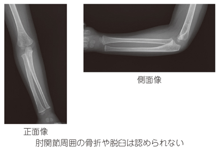
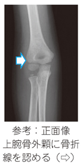
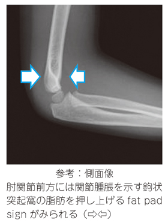

# 肘内障（橈骨頭亜脱臼）

> 幼児の手や前腕を急に引くことで、[[輪状靱帯]]が橈骨頭に挟まる病態。典型例では明らかな外傷、腫脹、変形がなく、徒手整復で速やかに改善する。

## 要点

- 好発は**1〜4歳**。手を引かれた後に患肢を動かさず、肘を軽く屈曲・前腕回内位で保持する。とくに**回外**で痛がり、制限される。
- 典型的には著明な腫脹・皮下出血・骨性圧痛・変形が乏しい。肩・手関節の可動域、橈骨動脈拍動、手指の感覚は保たれる。
- **転倒・直接打撲**、明らかな腫脹や変形、限局した骨性圧痛、脈拍・感覚の異常があれば[[小児の肘関節骨折]]を疑い、整復前にX線で評価する。
- 肘関節X線の**後方fat pad sign**は関節血症・関節液貯留を示し、明らかな骨折線がなくても潜在骨折を疑う。前方fat padの挙上（sail sign）も参考になる。
- 整復後も患肢を使わない、または疼痛が持続する場合は、骨折・別の外傷を再評価する。

典型的な肘内障では、正面・側面X線で明らかな骨折や脱臼を認めない。

骨折線やfat pad signは、肘内障と決めつけず骨折を疑う所見である。

## CBTチェック

- 「幼児・手を引かれた・腫脹なし・患肢を使わない」→ **輪状靱帯の転位による肘内障**。治療は**徒手整復**。
- 「転倒・腫脹・骨性圧痛・骨折線またはfat pad sign」→ **骨折を優先して考え、安易に整復しない**。
- fat pad signは骨折線そのものではなく、**肘関節内の出血・関節液を示す間接所見**である。
