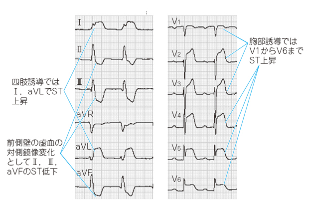

# 冠攣縮性狭心症

> **冠攣縮性狭心症（vasospastic angina）**は、冠動脈の一過性攣縮により心筋虚血を来す狭心症。安静時、とくに夜間〜早朝に胸痛を生じることが多い。

## 要点

- 冠動脈攣縮による一時的な狭窄・閉塞で起こる。喫煙は重要な危険因子である。
- 安静時の胸痛、発作時の**一過性**ST上昇を認める。ST上昇は責任冠動脈の灌流域に対応する誘導に出現し、対側誘導ではST低下を伴いうる。労作で誘発されることもある。
- 発作時は[[ニトログリセリン]]の舌下投与で速やかに軽快する。
- 予防には[[カルシウム拮抗薬]]が有効で、必要に応じて硝酸薬を併用する。
- 冠攣縮を悪化させうるため、[[β遮断薬]]の単独投与は避ける。

I・aVLとV1〜V6のST上昇は前壁〜側壁の虚血を示す局在性変化であり、II・III・aVFのST低下は対側性変化である。**全誘導でSTが上昇しているわけではない。**

## CBTチェック

- 安静時・夜間早朝の胸痛＋発作時ST上昇＋ニトログリセリンで軽快 → 冠攣縮性狭心症を考える。
- 発作時ST上昇を示す異型狭心症は冠攣縮性狭心症に含まれ、労作で誘発される例もある。
- ST上昇だけで心筋壊死とは決めない。一方、持続性ST上昇やトロポニン上昇を伴う場合は、[[急性心筋梗塞]]として緊急評価する。
- 試験問題で多くの検査値が示されているのにトロポニン・CK-MBの上昇に触れず、ST変化が一過性なら、心筋壊死より冠攣縮を考える補助所見となる。実臨床では未測定を正常とは扱わず、心筋マーカーを測定する。
- 発作時はニトログリセリン、予防はカルシウム拮抗薬が基本である。
