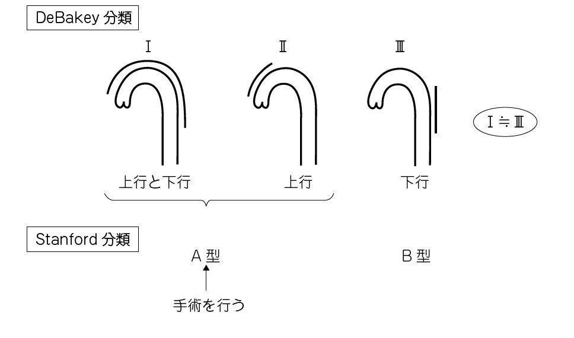

# 急性大動脈解離

> **急性大動脈解離**は、大動脈壁の内膜に亀裂が生じ、真腔と偽腔に分かれる緊急疾患である。突然の移動性胸背部痛と[[高血圧症|高血圧]]が重要な手がかりとなる。

## 要点

- 突然発症する激烈な胸背部痛が、解離の進展に伴って背部・腰部へ移動する。
- 危険因子は高血圧であり、上肢血圧の左右差や脈拍欠損は弓部分枝の閉塞を示唆する。
- 造影CTで内膜フラップ、真腔・偽腔、解離の範囲と臓器血流障害を迅速に評価する。
- Stanford A型（上行大動脈に解離あり）は緊急手術を要する。B型は合併症の有無で治療方針を判断する。
- A型では心囊内への穿破による[[心タンポナーデ]]、大動脈弁逆流、冠動脈灌流障害を合併しうる。
- 解離が分枝へ及ぶと、脳虚血、脊髄虚血、腸管虚血、腎不全、下肢虚血を生じうる。

Stanford分類では上行大動脈に解離が及ぶものをA型とし、緊急手術を考慮する。

出典：M3E CBT 問題番号18303451〜18303454（ユーザー提示、個人学習用）

## CBTチェック

- **突然の移動性胸背部痛＋血圧左右差**では急性大動脈解離を最優先で疑う。
- 問題文の「上肢血圧左右差＋縦隔陰影拡大」→ 急性大動脈解離を考える（M3E 18301490）。
- 迅速な確定・範囲診断には**造影CT**を選ぶ。
- A型＋心囊液貯留＋[[ショック]]では、[[心タンポナーデ]]を考える。
- 右総頸動脈が偽腔により閉塞すると、右大脳半球虚血による左片麻痺を来す。
