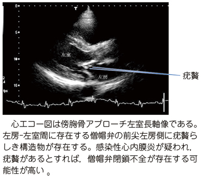

# 感染性心内膜炎

> 血流中の微生物が心内膜、主に弁に感染して**疣贅**を形成する全身性感染症。弁破壊による[[心不全]]と、疣贅の脱落による塞栓症が重要である。

## 要点

- 人工弁・弁形成材料、感染性心内膜炎の既往、特定の先天性心疾患、静注薬物使用などはリスクとなる。口腔衛生が重要で、[[抗菌薬]]予防は原則として**高リスク患者の侵襲的歯科処置**に限る。
- 起炎菌は[[レンサ球菌]]（口腔由来のviridans群）や[[黄色ブドウ球菌]]が代表的である。
- 疣贅は血小板・フィブリン・微生物からなり、弁破壊による[[僧帽弁閉鎖不全症]]、持続菌血症、脳・腎・脾などへの[[敗血症性塞栓症]]を来す。僧帽弁逆流では左室容量負荷から左心不全を生じうる。
- 末梢所見には、有痛性の[[Osler結節]]、無痛性のJaneway病変、Roth斑、爪下線状出血がある。
- 診断の基本は抗菌薬投与前の複数セット[[血液培養]]と[[心エコー]]である。TTEで不十分な場合や人工弁例ではTEEを用い、[[Duke基準]]で総合的に判断する。
- [[Levine分類]]の2/6度の心雑音

傍胸骨アプローチ長軸像。僧帽弁の左房側に疣贅を示す構造を認め、僧帽弁逆流の合併を評価する。

## CBTチェック

- 発熱＋新規心雑音＋塞栓症状では感染性心内膜炎を疑う。
- Osler結節は免疫学的現象、Janeway病変は血管現象に分類される。
- 問診では**基礎心疾患・歯科処置歴**、皮膚症状、心不全症状を確認する。関節痛は非特異的である。
