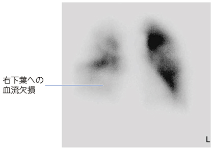

# 肺血栓塞栓症

> **肺血栓塞栓症（pulmonary thromboembolism：PTE）**は、主に下肢の[[深部静脈血栓症]]が肺動脈を閉塞する疾患である。手術後・長期臥床後の急な呼吸困難、胸痛、頻脈ではまず疑う。

## 要点

- 危険因子は手術、臥床、悪性腫瘍、妊娠・産褥、肥満などである。
- 突然の呼吸困難、胸痛、頻脈、低酸素血症を呈し、下肢腫脹は[[深部静脈血栓症]]を示唆する。
- 循環動態が安定していれば、診断の中心は[[造影CT]]（CT肺動脈造影）である。
- 造影CTが行えない場合などに、[[肺換気血流シンチグラフィ]]を用いる。肺血流シンチグラフィでは閉塞部位に一致した血流欠損を示す。
- [[ショック]]や低血圧を伴う高リスク例では、心エコーで右心負荷を評価し、迅速な再灌流治療を検討する。

肺血流シンチグラフィの血流欠損は肺塞栓を示唆するが、換気所見や臨床像と合わせて判断する。

## CBTチェック

- **術後の初回歩行時に急な呼吸困難・胸痛・頻脈**をみたら[[肺血栓塞栓症]]を考える。
- 肺血流シンチグラフィでは、血栓による**区域性の血流欠損**が手掛かりになる。
- [[肺拡散能検査]]、運動負荷心電図、心筋シンチグラフィは急性PTEの初期診断検査ではない。
