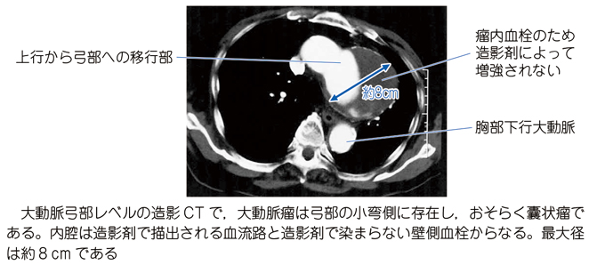

# 胸部大動脈瘤

> 胸部大動脈瘤（thoracic aortic aneurysm：TAA）は、胸部大動脈が拡張した状態である。瘤の拡大や破裂により、周囲臓器の圧迫症状や致死的出血を来す。

## 要点

- 高齢、[[高血圧症|高血圧]]、喫煙、動脈硬化、遺伝性結合組織疾患などが危険因子である。
- 多くは無症状だが、弓部瘤は左反回神経の圧迫により嗄声を、食道・気管支の圧迫により嚥下障害・呼吸症状を生じうる。
- 胸背部痛は瘤の急速な拡大、切迫破裂、[[大動脈解離]]を疑う緊急所見である。
- 造影CTで部位・径・壁在血栓・周囲臓器との関係を評価する。
- 血圧管理と画像フォローを行い、瘤径・拡大速度・症状に応じて人工血管置換術またはステントグラフト内挿術を検討する。

M3E問題18302390の胸部造影CT（個人学習用）。弓部に約8 cmの瘤と壁在血栓を認める。

## CBTチェック

- 高血圧の高齢者で、嗄声＋胸背部痛＋胸部X線の左第1弓拡大 → 胸部大動脈瘤を考える。
- 嗄声は拡大した大動脈瘤による左反回神経圧迫（Ortner症候群）で起こりうる。
- [[腹部大動脈瘤]]は腹部拍動性腫瘤・腹背部痛が典型で、胸部大動脈瘤とは部位と圧迫症状が異なる。
