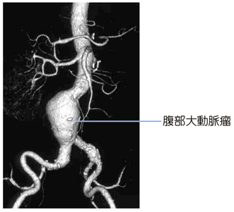

# 腹部大動脈瘤

> 腹部大動脈瘤（abdominal aortic aneurysm：AAA）は、腹部大動脈が限局性に拡張する疾患。破裂すると大量出血から[[外傷性出血性ショックの初期対応|出血性ショック]]を来す。

## 要点

- 高齢男性に多く、喫煙、高血圧、[[動脈硬化]]が重要な危険因子である。多くは腎動脈分岐部より末梢に生じる。
- 多くは無症状だが、腹部拍動性腫瘤、腹痛・腰背部痛を認める。新たな痛みは瘤の拡大・切迫破裂を疑う手がかりとなる。
- 安定例のスクリーニングには腹部超音波が有用で、造影CTでは最大径、範囲、分枝との関係、破裂の有無を評価する。
- 破裂では腹痛・腰背部痛、拍動性腹部腫瘤、血圧低下・[[ショック]]が典型であり、緊急治療を要する。
- 瘤径、症状、拡大速度、形状を基に、経過観察、人工血管置換術、ステントグラフト内挿術（EVAR）を選択する。

腎動脈下に瘤状拡張を認める腹部大動脈瘤の3D-CT像（M3E 18304293、個人学習用）。

## CBTチェック

- 高齢者の腹部拍動性腫瘤では、腹痛・**腰背部痛**の有無を優先して確認する（M3E 18304291）。
- 安定した疑い例で超音波が選択肢になければ、腹部造影CTで瘤の形態と破裂徴候を評価する（M3E 18304292）。
- 最重要合併症は破裂による出血性ショックで、主な背景は動脈硬化性変化である（M3E 18304293・18304294）。
