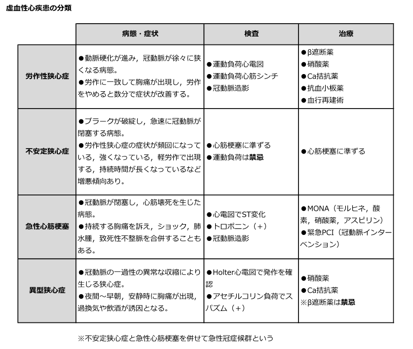

# 虚血性心疾患の鑑別

> **虚血性心疾患**は、冠動脈血流の低下による心筋虚血である。症状の安定性、心電図、[[トロポニン]]で、慢性の労作性狭心症と[[急性冠症候群]]を分ける。

## 鑑別の要点

| 疾患 | 典型像 | 心電図・トロポニン |
|---|---|---|
| [[労作性狭心症]] | 一定の労作で胸痛が出現し、安静で数分以内に軽快 | 発作時のST低下が多い／トロポニン陰性 |
| [[不安定狭心症]] | 新規・増悪・安静時の胸痛 | 虚血性変化を伴いうる／トロポニン上昇なし |
| [[急性心筋梗塞]] | 持続する胸痛、冷汗、呼吸困難など | ST上昇またはST低下など＋トロポニン上昇・下降 |
| [[冠攣縮性狭心症]] | 夜間〜早朝の安静時胸痛、発作は一過性 | 発作時の局在性ST上昇／通常は壊死マーカー陰性 |

- 労作性狭心症は冠動脈の固定性狭窄が主であり、負荷心電図、冠動脈CT、心筋血流評価などで虚血を評価する。
- 不安定狭心症と急性心筋梗塞は[[急性冠症候群]]である。両者は症状が似るため、トロポニンの上昇・下降が壊死の有無を分ける。
- [[冠攣縮性狭心症]]は冠動脈の一過性攣縮による。発作時にST上昇を示しても、それだけで心筋壊死とはいえない。
- 急性冠症候群が疑われる胸痛は、心電図とトロポニンを経時的に評価し、再灌流治療の適応を急いで判断する。

提示図は4病態の典型像を復習するための概略図である。急性冠症候群の治療は病態と緊急度に応じて行い、「MONA」を一律の治療手順としては扱わない。

## CBTチェック

- 安静で軽快する一定の労作時胸痛 → 労作性狭心症。
- 安静時にも出現・増悪する胸痛＋トロポニン陰性 → 不安定狭心症。
- 心筋虚血の所見＋トロポニン上昇・下降 → [[急性心筋梗塞]]。
- 夜間〜早朝の安静時胸痛＋一過性ST上昇 → [[冠攣縮性狭心症]]。
