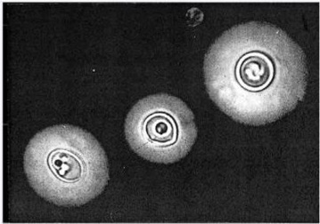

# クリプトコックス髄膜炎

> クリプトコックス髄膜炎は、莢膜をもつ酵母様真菌であるCryptococcusによる中枢神経感染症で、白血病治療中、AIDS、悪性リンパ腫などの免疫不全者に起こりやすい。

## 要点

- 髄液のインディアン・インク染色で、黒い背景に染まらない莢膜をもつ酵母がハロー状にみえる。
- 原因菌は主にCryptococcus neoformansで、ハトの排泄物などが感染源となる。
- 髄液のクリプトコックス抗原（CrAg）、培養、髄液検査を組み合わせて診断する。インディアン・インクは迅速だが感度に限界がある。
- 頭痛、発熱、項部硬直のほか、免疫不全者では[[意識障害]]や局所神経症状を呈することがある。

髄液のインディアン・インク染色で、莢膜をもつ酵母を示す（M3E 18201320、個人学習用）。

## CBTチェック

- 「免疫不全」＋「髄液のインディアン・インク染色」→ クリプトコックス髄膜炎。
- 「黒い背景」＋「透明なハロー」→ Cryptococcusの厚い莢膜を考える。
- 真菌性髄膜炎の代表として、細菌性・ウイルス性・寄生虫性髄膜炎と区別する。
