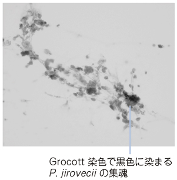

# ニューモシスチス肺炎

> ニューモシスチス肺炎（Pneumocystis jirovecii pneumonia：PCP）は、**細胞性免疫低下**で発症する日和見肺炎である。HIV感染のほか、免疫抑制薬使用中にも生じる。

## 要点

- 亜急性の発熱、乾性咳嗽、労作時呼吸困難、低酸素血症を示す。聴診ではfine cracklesを聴取しうる。
- HIVではCD4陽性T細胞数200/μL未満が重要な危険因子で、メトトレキサートなどの免疫抑制状態でも発症しうる。
- 胸部CTでは両側びまん性すりガラス影が典型。血中β-D-グルカンは補助診断に有用である。
- 誘発喀痰または気管支肺胞洗浄液（BAL）でのPCR・Grocott染色などによる病原体検出で診断する。
- 治療・予防の第一選択は[[ST合剤]]（トリメトプリム・スルファメトキサゾール）である。

M3E問題18303844のGrocott染色（個人学習用）。黒く染まるP. jiroveciiの集塊を示す。

## CBTチェック

- 細胞性免疫低下＋乾性咳嗽・労作時呼吸困難＋β-D-グルカン高値 → ニューモシスチス肺炎を考える。
- 確定には喀痰またはBALで病原体を検出する。通常の喀痰培養では検出しにくい。
- [[間質性肺炎]]やメトトレキサート肺障害と症状・画像が似るため、発熱と免疫抑制状態では感染症を除外する。
