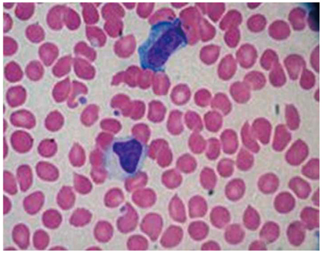
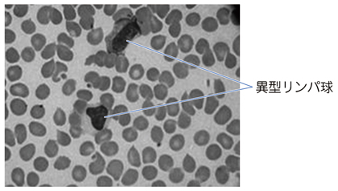

# 伝染性単核球症

> 伝染性単核球症は、主に[[Epstein–Barrウイルス（EBV）]]の初感染によって若年者に発症し、発熱・咽頭炎・リンパ節腫脹・肝脾腫を来す疾患である。

## 要点

末梢血塗抹標本で、濃染する広い細胞質をもつ異型リンパ球を認める。M3E CBT 問題番号18300440、個人学習用。

異型リンパ球の位置を示す注釈画像。M3E CBT 問題番号18300440、個人学習用。

- EBVは唾液を介して感染し、若年者の発熱、咽頭炎・扁桃炎、頸部リンパ節腫脹、肝脾腫を来す。
- 末梢血では白血球増加、[[異型リンパ球]]増加、AST・ALT上昇を認める。
- 異型リンパ球はEBV感染B細胞に反応して増殖したCD8陽性細胞傷害性T細胞である。
- 診断はEBV抗体（VCA-IgMなど）で確認する。
- 脾腫では脾破裂に注意し、腹部への強い衝撃を避ける。急性期の[[口蓋扁桃摘出術]]は通常行わない。

## CBTチェック

- 発熱＋咽頭炎＋頸部リンパ節腫脹＋肝脾腫＋異型リンパ球 → 伝染性単核球症。
- 異型リンパ球は**B細胞ではなく、活性化CD8陽性T細胞**。
