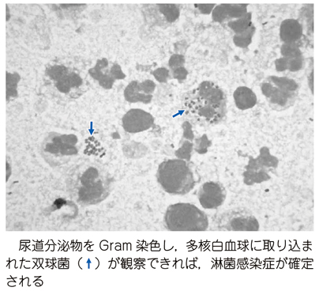
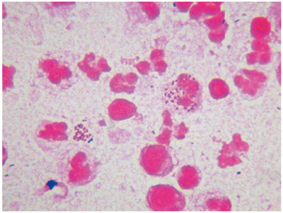

# 淋菌性尿道炎

> **淋菌性尿道炎**は[[淋菌]]（*Neisseria gonorrhoeae*）による[[急性尿道炎]]の代表的な性感染症である。男性では、短い潜伏期の後に排尿痛と黄白色の膿性尿道分泌物を来す。

## 要点

- 感染機会の約2〜9日後に、尿道の掻痒感、排尿痛、膿性尿道分泌物が出現する。
- 尿道分泌物の塗抹[[グラム染色]]で、好中球内に**腎臓形のグラム陰性双球菌**を認めることが典型である。
- メチレンブルー単染色でも、白血球内・外の双球菌を確認できる。
- 核酸増幅検査（NAAT）や培養で確定し、薬剤感受性も考慮する。
- 治療は**セフトリアキソン1 g単回静注**を基本とする。[[クラミジア]]との重複感染を評価し、性的パートナーの検査・治療も行う。

尿道分泌物のGram染色で、好中球内に貪食された双球菌を認める典型像。

## CBTチェック

- 膿性尿道分泌物 + 好中球内グラム陰性双球菌 → **淋菌性尿道炎**を考える。
- 急性尿道炎に対する[[尿道ブジー法]]は炎症を悪化・拡散させる危険があり禁忌である。
- 薬剤耐性が多いため、テトラサイクリン系・ニューキノロン系の長期内服やアミノグリコシド系筋注を第一選択としない。
