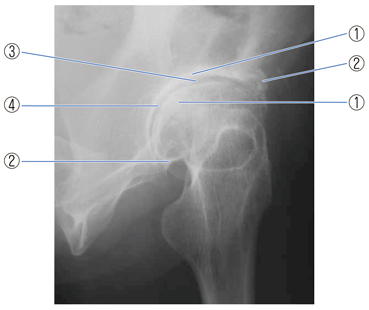

# 変形性股関節症

> 股関節の関節軟骨が摩耗・変性し、軟骨下骨や関節辺縁にも変化を来す慢性疾患。日本では[[発育性股関節形成不全]]などを背景とする二次性が多い。

## 要点

- 初期は歩き始めや立ち上がりの痛み、進行すると歩行時痛・可動域制限・跛行を来す。股関節由来の痛みは鼠径部を中心に感じやすい。
- X線では関節裂隙狭小化、軟骨下骨硬化、骨棘形成、関節面不整を認める。
- 変形性関節症では骨萎縮は典型所見ではなく、むしろ軟骨下骨硬化などの骨増殖性変化が目立つ。
- 原因のない一次性と、発育性股関節形成不全・先天性股[[関節脱臼]]などを背景とする二次性に分ける。
- 治療は体重・活動量の調整、運動療法、鎮痛薬などを基本とし、進行して日常生活への支障が大きければ人工股関節置換術を検討する。

変形性股関節症のX線。関節裂隙狭小化、臼蓋・大腿骨頭側の骨棘、軟骨下骨硬化、関節面不整を示す（M3E問題画像、個人学習用）。

## CBTチェック

- 「関節裂隙狭小化＋軟骨下骨硬化＋骨棘」→ 変形性股関節症。
- 「骨硬化・骨棘・関節面不整」→ 変形性関節症。「骨萎縮」→ 典型的ではない。
- 「発育性股関節形成不全・先天性股関節脱臼の既往」→ 二次性変形性股関節症を考える。
