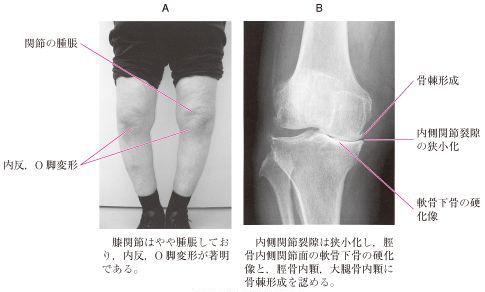

# 変形性膝関節症

> 荷重・摩擦などの機械的ストレスで[関節軟骨](../../01_基礎医学/解剖/関節軟骨.md)が変性・摩耗し、軟骨下骨の変化や骨棘形成を伴って膝関節が変形する疾患。

## 要点

- 初期は立ち上がり・歩き始めなどの初動時痛、進行すると荷重・運動時痛や歩行時痛、関節腫脹、可動域制限をきたす。関節液貯留を伴うこともある。
- 変形性関節症では全身性の炎症反応は通常目立たず、関節液は淡黄色透明の非炎症性である。急性発症で炎症反応が上昇する場合は[[偽痛風]]などを考える。
- X線：関節裂隙狭小化、軟骨下骨硬化、骨棘形成、進行例では関節裂隙消失。
- 多くは内側型で、大腿骨・脛骨内側顆の摩耗が進み、**内反膝（O脚）**となる。
- [関節リウマチ](../膠原病・免疫/関節リウマチ.md)では炎症性破壊により外側の変化が目立ち、外反膝（X脚）となることがある。
- 治療は体重・運動調整、鎮痛薬、運動療法などを基本とし、進行例では骨切り術や人工膝関節置換術を検討する。
- 保存療法では大腿四頭筋の筋力強化、体重管理、杖・膝装具・楔状足底板などを用いる。杖は原則として患側と反対側の手で持つ。
- 深い膝屈曲で痛みが増悪する場合は、正座などの動作を避ける。保存療法で疼痛や機能障害が残る進行例では、高位脛骨骨切り術や人工膝関節置換術を検討する。

### 画像所見（提示画像、個人学習用）

M3E CBT問題279974328の提示画像。Aは内反・O脚変形、Bは内側関節裂隙狭小化、軟骨下骨硬化、骨棘形成を示す。

![[Pasted image 20260819154030.png]]
## CBTチェック

- 膝OAの典型X線：**関節裂隙狭小化＋骨棘＋軟骨下骨硬化**。
- 内側型OA → 内反膝（O脚）。
- 関節軟骨の摩耗に続いて軟骨下骨・骨棘などの骨変化が進行する。
- 「大腿四頭筋強化」「体重減少」「患側と反対側の杖」→ 保存療法として推奨される。
- 「正座で疼痛増悪」→ 深い膝屈曲を避ける。「保存療法で改善しない重症例」→ 手術療法を検討する。
