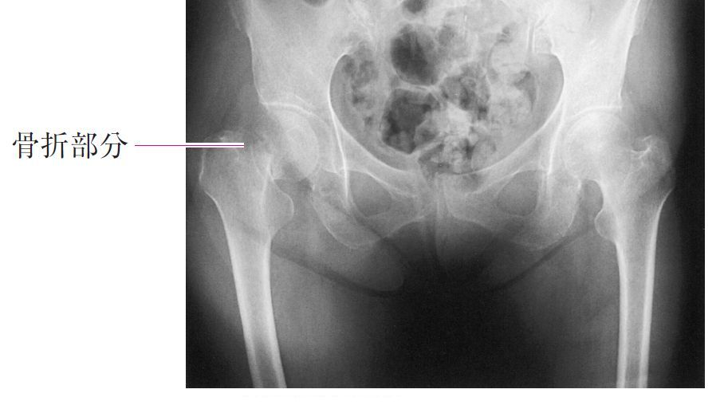

# 大腿骨頸部骨折

> 大腿骨頸部骨折は高齢者の転倒で起こりやすい股関節周囲骨折で、歩行困難・股関節痛をきたす。関節包内の内側骨折では大腿骨頭壊死に注意する。

## 要点

- 高齢者が軽微な転倒後に歩けなくなったらまず疑う。患肢短縮・外旋位をとることがある。
- Garden分類：I・IIは転位が少なく、III・IVは転位型。転位型では骨頭への血流障害と偽関節リスクが高い。
- 内側大腿骨頸部骨折は関節包内で骨頭への血流が損なわれやすく、骨癒合不全・大腿骨頭壊死を起こしやすい。
- 82歳のGarden III・IVなど転位型内側骨折では、骨接合術より人工骨頭置換術（全身状態・活動性により人工股関節全置換術）を選択することが多い。
- 診断は股関節X線の正面・軸位撮影を基本とし、X線で不明でも疑いが強ければMRIを考慮する。
- 早期手術と早期離床・リハビリテーションで、肺炎・深部静脈血栓・廃用を予防する。

画像はM3E問題280525278の提示画像（個人学習用）。右大腿骨頸部に骨折線を認める。

## CBTチェック

- 問題文の「高齢者＋転倒＋歩行困難」→ 大腿骨頸部骨折を考える。
- 「Garden III/IV＋高齢者」→ 人工骨頭置換術（または全置換術）を考える。
- 「Garden I/II・若年者」→ 骨接合術を連想する。
- 「骨癒合しにくい骨折」→ 大腿骨頸部内側、上腕骨解剖頸、距骨、舟状骨、脛骨中下1/3を連想する。
