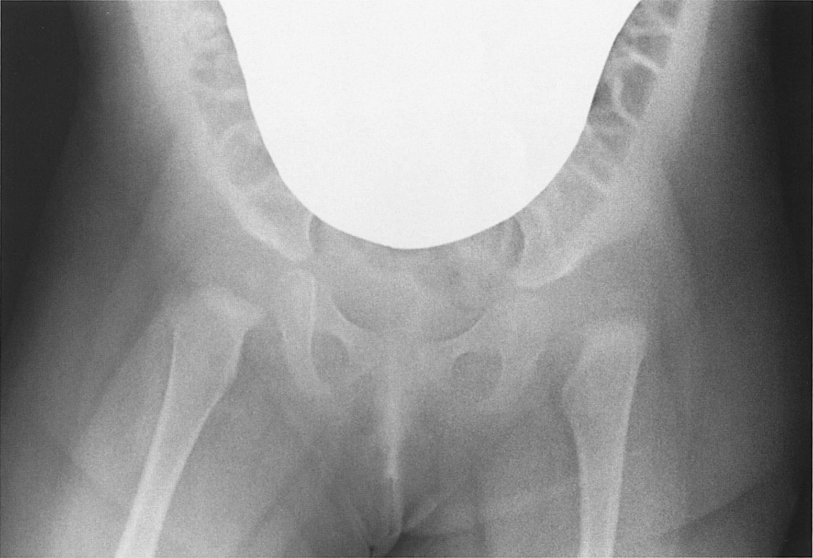

# 発育性股関節形成不全

> **発育性股関節形成不全（DDH：developmental dysplasia of the hip）**は、乳幼児期の股関節の不安定性から、亜脱臼・脱臼、臼蓋形成不全に至る病態である。未治療で歩行年齢を超えると跛行や[[Trendelenburg徴候]]を来す。

## 要点

- 年長児では**開排制限**、跛行、Trendelenburg徴候、腰椎前弯の増強などが手掛かりになる。
- 乳児期の発育性股関節形成不全は**女児に多い**。
- 両側例では、片側例にみられる脚長差や大腿皮膚溝の左右差が目立たないことがある。一方、両側の外転筋不全によるTrendelenburg徴候や歩容異常はみられうる。
- 脱臼した大腿骨頭は臼蓋から上方・外側（問題によっては前上方）へ偏位する。
- 長期間未治療でも「両側股関節の著明な拘縮」が必ずみられるわけではない。

### 画像所見

提示された骨盤X線では、両側の大腿骨頭が臼蓋に十分被覆されず、上方・外側へ偏位している。臼蓋形成不全を示す画像（個人学習用、ユーザー提示画像）。

## CBTチェック

- 「4歳・未治療・両側・跛行」→ 両側Trendelenburg徴候、開排制限、骨頭の上方偏位を考える。
- 「皮膚溝の左右差」→ 一側性脱臼では手掛かりになるが、両側例では左右差が出にくい。
- 一言暗記：**両側DDHは跛行・両側Trendelenburg・開排制限、皮膚溝の左右差は目立ちにくい**。
