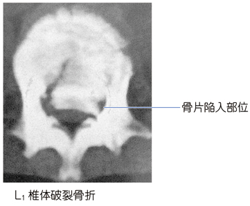

# 胸腰椎椎体破裂骨折

> 転落などの高エネルギー軸圧で椎体が破砕し、後方骨皮質・骨片が脊柱管内へ突出する不安定骨折。胸腰椎移行部（T11〜L1）に多く、[[脊髄損傷]]や馬尾障害を来しうる。

## 要点

- **椎体前方のみの圧潰**を主とする圧迫骨折と異なり、椎体後壁の破綻と骨片の脊柱管内陥入が破裂骨折の重要所見である。
- 脊柱管の狭窄により、下肢の運動・感覚障害、会陰部感覚低下、排尿・排便障害を起こしうる。神経学的所見を繰り返し確認する。
- CTは骨折形態・脊柱管内骨片を評価し、MRIは脊髄・神経根、靱帯、硬膜外血腫の評価に用いる。
- 初期対応では脊柱を保護して体幹を不用意に動かさず、神経障害や不安定性があれば早期に専門的治療（除圧・固定を含む）へつなぐ。
- 高位脊髄損傷（おおむね**T6以上**）では[[神経原性ショック]]を合併し、低血圧・徐脈・温かい皮膚を示す。外傷後の低血圧では、まず[[外傷性出血性ショックの初期対応|出血性ショック]]を除外する。

L1椎体破裂骨折のCT。椎体後方の骨片が脊柱管内へ陥入している。

## CBTチェック

- 転落・軸圧外傷 + 胸腰椎移行部痛 → **椎体破裂骨折**を考え、脊髄・馬尾の神経所見を確認する。
- 破裂骨折では、**椎体後壁の破綻と脊柱管内骨片**がポイント。
- 外傷後の低血圧を脊髄損傷だけで説明せず、まず**出血性ショック**を評価する。
