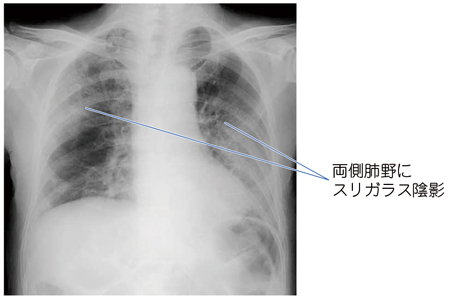

# 脂肪塞栓症

> [[大腿骨骨幹部骨折]]などの長管骨骨折後に、骨髄由来の脂肪滴によって肺・脳などの臓器障害を来す病態。呼吸障害、神経症状、点状出血を伴う場合を脂肪塞栓症候群（FES）と呼ぶ。

## 要点

- 長管骨・骨盤骨折 → 骨髄脂肪の流入と炎症反応 → 肺障害、低酸素血症、意識障害。
- 発症は受傷後すぐではなく、通常24〜72時間後の潜伏期を経て出現する。
- 典型的な3徴は、呼吸困難・低酸素血症、神経症状（意識障害など）、点状出血。3徴がそろわないこともある。
- 胸部X線・CTでは両側性の浸潤影やすりガラス陰影を示しうる。脳MRIでは脂肪微小塞栓による「starfield pattern」が参考になる。
- 特異的な根治薬はなく、酸素化・呼吸管理などの支持療法と骨折の早期固定が基本となる。

両側肺野のすりガラス陰影を示す胸部X線（M3E問題画像、個人学習用）。

## CBTチェック

- 「長管骨骨折後、24〜72時間」「突然の呼吸困難＋意識障害」→ 脂肪塞栓症候群を考える。
- 「両側肺野のすりガラス陰影」＋長管骨骨折 → 脂肪塞栓による急性肺障害を考える。
- 脂肪塞栓（脂肪滴が血中に存在）と、呼吸・神経・皮膚症状を呈する脂肪塞栓症候群を区別する。
