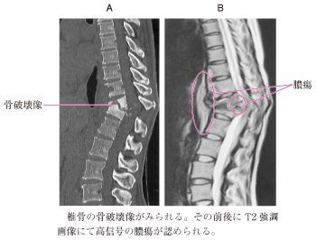

# 脊椎カリエス

> 脊椎カリエス（結核性脊椎炎）は、結核菌によって脊椎の椎体・椎間板周囲に慢性炎症と骨破壊を生じる病態である。腰背部痛が長く続き、傍椎体膿瘍や脊髄圧迫を合併することがある。

## 要点

- 数か月単位の腰背部痛、全身倦怠感、微熱や体重減少などで発症し、炎症反応が目立たないこともある。
- CTでは椎体の骨破壊・圧潰や脊柱変形、MRIでは椎体病変と傍椎体・硬膜外膿瘍、脊髄圧迫を評価する。
- 生検で乾酪壊死を伴う類上皮細胞肉芽腫を認めると結核を強く示唆する。確定には結核菌の培養・核酸増幅検査などを組み合わせる。
- 化膿性脊椎炎より椎間板が比較的保たれ、傍椎体膿瘍が大きくなりやすい点が鑑別の手掛かりになる。
- 治療は抗結核薬が基本。神経障害、脊柱不安定性・変形、進行する膿瘍などでは外科的治療を検討する。

椎体の骨破壊と、その前後にみられる高信号の傍椎体・硬膜外膿瘍（M3E問題画像、個人学習用）。

## CBTチェック

- 「慢性腰背部痛」「乾酪壊死を伴う肉芽腫」→ 脊椎カリエス（結核性脊椎炎）。
- 「椎体骨破壊＋傍椎体膿瘍」→ 脊椎カリエスを考える。
- 「椎間板腔狭小化＋終板破壊」「急性の発熱・炎症反応上昇」→ [[化膿性脊椎炎]]を考える。
